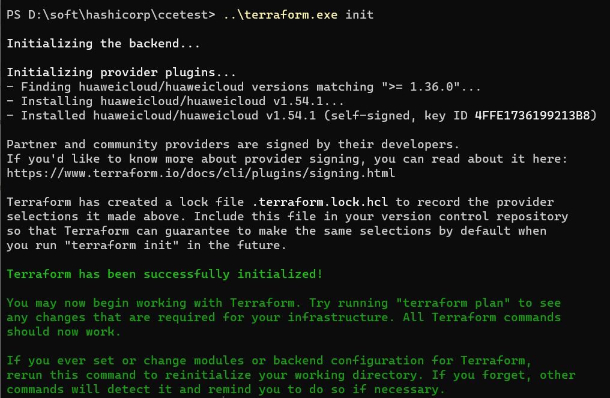
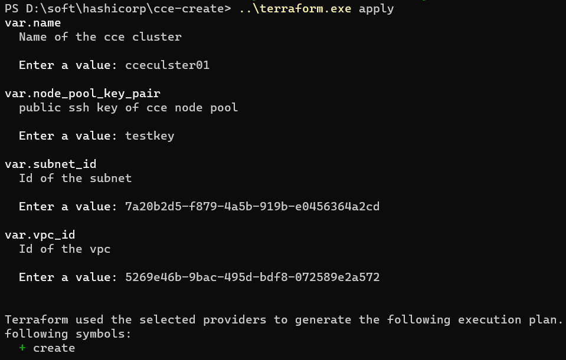
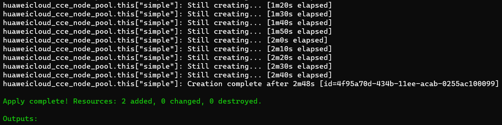

!!! note

    Note: In the case of high availability, select a node with a relatively large instance. (The corresponding node size does not cause a large waste of resources.)

The following extra overheads are required on each node. If these overheads are excluded, the real service workload is running.

1. Operating system
1. kubelet and kube-proxy
1. Docker or other container runtime service

[k8s architecture](https://kubernetes.io/docs/concepts/overview/components/)

When creating a cluster, you can determine the cluster scale based on the actual project load and resource usage.

## 1. Terraform Create CCE cluster

### Terraform Code

**versions.tf**

```terraform
terraform {
  required_providers {
    huaweicloud = {
      source  = "huaweicloud/huaweicloud"
      version = ">= 1.36.0"
    }
  }
}
```

**variables.tf**


```terraform
variable "name" {
  description = "Name of the cce cluster"
}

variable "flavor_id" {
  description = "Flavor of the cce cluster"
  default     = "cce.s1.small"
}

variable "vpc_id" {
  description = "Id of the vpc"
}

variable "subnet_id" {
  description = "Id of the subnet"
}

variable "node_pool" {
  description = "cce node pool feature"
  default = {
    simple = {
      name      = "generic"
      os        = "EulerOS 2.5"
      flavor_id = "s6.large.2"
    }
  }
}

variable "node_pool_key_pair" {
  description = "public ssh key of cce node pool"
}
```

**main.tf**

Modify the AK/SK information to the actual Information

```terraform
provider "huaweicloud" {
  region     = "sa-brazil-1"
  access_key = "your ak"
  secret_key = "you sk"
}

resource "huaweicloud_cce_cluster" "this" {
  name                   = var.name
  flavor_id              = var.flavor_id
  vpc_id                 = var.vpc_id
  subnet_id              = var.subnet_id
  multi_az               = false
  container_network_type = "overlay_l2"
}

resource "huaweicloud_cce_node_pool" "this" {
  for_each          = var.node_pool
  name              = each.value.name
  os                = each.value.os
  flavor_id         = each.value.flavor_id
  availability_zone = try(each.value.availability_zone, "random")

  scall_enable             = try(each.value.scall_enable, false)
  initial_node_count       = try(each.value.initial_node_count, 1)
  min_node_count           = try(each.value.min_node_count, 0)
  max_node_count           = try(each.value.max_node_count, 0)
  scale_down_cooldown_time = try(each.value.scale_down_cooldown_time, 0)
  priority                 = try(each.value.priority, 0)

  cluster_id = huaweicloud_cce_cluster.this.id
  key_pair   = var.node_pool_key_pair
  type       = "vm"


  root_volume {
    size       = 40
    volumetype = "SAS"
  }
  data_volumes {
    size       = 100
    volumetype = "SAS"
  }
}
```


### Create Cluster and Node use Terraform

We can create the VPC,subenet,sskey in advance, And we can create use terraform also. 

- vpcid  5269e46b-9bac-495d-bdf8-072589e2a572
- subnetid 7a20b2d5-f879-4a5b-919b-e0456364a2cd
- key testkey


**Initialization**

If you use it for the first time, you need to initialize for download provider plugins.




```bash
PS D:\soft\hashicorp\cce-create> ..\terraform.exe apply
var.name
  Name of the cce cluster

  Enter a value: cceculster01

var.node_pool_key_pair
  public ssh key of cce node pool

  Enter a value: testkey

var.subnet_id
  Id of the subnet

  Enter a value: 7a20b2d5-f879-4a5b-919b-e0456364a2cd

var.vpc_id
  Id of the vpc

  Enter a value: 5269e46b-9bac-495d-bdf8-072589e2a572


Terraform used the selected providers to generate the following execution plan. Resource actions are indicated with the
following symbols:
  + create

Terraform will perform the following actions:

  # huaweicloud_cce_cluster.this will be created
  + resource "huaweicloud_cce_cluster" "this" {
      + authentication_mode    = "rbac"
      + billing_mode           = (known after apply)
      + certificate_clusters   = (known after apply)
      + certificate_users      = (known after apply)
      + charging_mode          = (known after apply)
      + cluster_type           = "VirtualMachine"
      + cluster_version        = (known after apply)
      + container_network_cidr = (known after apply)
      + container_network_type = "overlay_l2"
      + description            = (known after apply)
      + eni_subnet_cidr        = (known after apply)
      + eni_subnet_id          = (known after apply)
      + enterprise_project_id  = (known after apply)
      + flavor_id              = "cce.s1.small"
      + highway_subnet_id      = (known after apply)
      + id                     = (known after apply)
      + kube_config_raw        = (known after apply)
      + multi_az               = false
      + name                   = "cceculster01"
      + region                 = (known after apply)
      + security_group_id      = (known after apply)
      + service_network_cidr   = (known after apply)
      + status                 = (known after apply)
      + subnet_id              = "7a20b2d5-f879-4a5b-919b-e0456364a2cd"
      + vpc_id                 = "5269e46b-9bac-495d-bdf8-072589e2a572"

      + masters {
          + availability_zone = (known after apply)
        }
    }

  # huaweicloud_cce_node_pool.this["simple"] will be created
  + resource "huaweicloud_cce_node_pool" "this" {
      + availability_zone        = "random"
      + billing_mode             = (known after apply)
      + charging_mode            = (known after apply)
      + cluster_id               = (known after apply)
      + current_node_count       = (known after apply)
      + flavor_id                = "s6.large.2"
      + id                       = (known after apply)
      + initial_node_count       = 1
      + initialized_conditions   = (known after apply)
      + key_pair                 = "testkey"
      + max_node_count           = 0
      + max_pods                 = (known after apply)
      + min_node_count           = 0
      + name                     = "generic"
      + os                       = "EulerOS 2.5"
      + priority                 = 0
      + region                   = (known after apply)
      + runtime                  = (known after apply)
      + scale_down_cooldown_time = 0
      + scall_enable             = false
      + security_groups          = (known after apply)
      + status                   = (known after apply)
      + type                     = "vm"

      + data_volumes {
          + dss_pool_id = (known after apply)
          + kms_key_id  = (known after apply)
          + size        = 100
          + volumetype  = "SAS"
        }

      + root_volume {
          + dss_pool_id = (known after apply)
          + kms_key_id  = (known after apply)
          + size        = 40
          + volumetype  = "SAS"
        }

      + storage {
          + groups {
              + cce_managed    = (known after apply)
              + name           = (known after apply)
              + selector_names = (known after apply)

              + virtual_spaces {
                  + lvm_lv_type     = (known after apply)
                  + lvm_path        = (known after apply)
                  + name            = (known after apply)
                  + runtime_lv_type = (known after apply)
                  + size            = (known after apply)
                }
            }

          + selectors {
              + match_label_count              = (known after apply)
              + match_label_metadata_cmkid     = (known after apply)
              + match_label_metadata_encrypted = (known after apply)
              + match_label_size               = (known after apply)
              + match_label_volume_type        = (known after apply)
              + name                           = (known after apply)
              + type                           = (known after apply)
            }
        }
    }

Plan: 2 to add, 0 to change, 0 to destroy.

Changes to Outputs:
  + certificate_clusters = (known after apply)
  + certificate_users    = (known after apply)
  + kubeconfig           = (known after apply)

Do you want to perform these actions?
  Terraform will perform the actions described above.
  Only 'yes' will be accepted to approve.

  Enter a value: yes

huaweicloud_cce_cluster.this: Creating...
huaweicloud_cce_cluster.this: Still creating... [10s elapsed]
huaweicloud_cce_cluster.this: Still creating... [20s elapsed]
huaweicloud_cce_cluster.this: Still creating... [30s elapsed]
huaweicloud_cce_cluster.this: Still creating... [40s elapsed]
huaweicloud_cce_cluster.this: Still creating... [50s elapsed]
huaweicloud_cce_cluster.this: Still creating... [1m0s elapsed]
huaweicloud_cce_cluster.this: Still creating... [1m10s elapsed]
huaweicloud_cce_cluster.this: Still creating... [1m20s elapsed]
huaweicloud_cce_cluster.this: Still creating... [1m30s elapsed]
huaweicloud_cce_cluster.this: Still creating... [1m40s elapsed]
huaweicloud_cce_cluster.this: Still creating... [1m50s elapsed]
huaweicloud_cce_cluster.this: Still creating... [2m0s elapsed]
huaweicloud_cce_cluster.this: Still creating... [2m10s elapsed]
huaweicloud_cce_cluster.this: Still creating... [2m20s elapsed]
huaweicloud_cce_cluster.this: Still creating... [2m30s elapsed]
huaweicloud_cce_cluster.this: Still creating... [2m40s elapsed]
huaweicloud_cce_cluster.this: Still creating... [2m50s elapsed]
huaweicloud_cce_cluster.this: Still creating... [3m0s elapsed]
huaweicloud_cce_cluster.this: Still creating... [3m10s elapsed]
huaweicloud_cce_cluster.this: Still creating... [3m20s elapsed]
huaweicloud_cce_cluster.this: Still creating... [3m30s elapsed]
huaweicloud_cce_cluster.this: Still creating... [3m40s elapsed]
huaweicloud_cce_cluster.this: Still creating... [3m50s elapsed]
huaweicloud_cce_cluster.this: Still creating... [4m0s elapsed]
huaweicloud_cce_cluster.this: Still creating... [4m10s elapsed]
huaweicloud_cce_cluster.this: Still creating... [4m20s elapsed]
huaweicloud_cce_cluster.this: Still creating... [4m31s elapsed]
huaweicloud_cce_cluster.this: Still creating... [4m41s elapsed]
huaweicloud_cce_cluster.this: Still creating... [4m51s elapsed]
huaweicloud_cce_cluster.this: Still creating... [5m1s elapsed]
huaweicloud_cce_cluster.this: Still creating... [5m11s elapsed]
huaweicloud_cce_cluster.this: Creation complete after 5m19s [id=8f979fa0-434a-11ee-acab-0255ac100099]
huaweicloud_cce_node_pool.this["simple"]: Creating...
huaweicloud_cce_node_pool.this["simple"]: Still creating... [10s elapsed]
huaweicloud_cce_node_pool.this["simple"]: Still creating... [20s elapsed]
huaweicloud_cce_node_pool.this["simple"]: Still creating... [30s elapsed]
huaweicloud_cce_node_pool.this["simple"]: Still creating... [40s elapsed]
huaweicloud_cce_node_pool.this["simple"]: Still creating... [50s elapsed]
huaweicloud_cce_node_pool.this["simple"]: Still creating... [1m0s elapsed]
huaweicloud_cce_node_pool.this["simple"]: Still creating... [1m10s elapsed]
huaweicloud_cce_node_pool.this["simple"]: Still creating... [1m20s elapsed]
huaweicloud_cce_node_pool.this["simple"]: Still creating... [1m30s elapsed]
huaweicloud_cce_node_pool.this["simple"]: Still creating... [1m40s elapsed]
huaweicloud_cce_node_pool.this["simple"]: Still creating... [1m50s elapsed]
huaweicloud_cce_node_pool.this["simple"]: Still creating... [2m0s elapsed]
huaweicloud_cce_node_pool.this["simple"]: Still creating... [2m10s elapsed]
huaweicloud_cce_node_pool.this["simple"]: Still creating... [2m20s elapsed]
huaweicloud_cce_node_pool.this["simple"]: Still creating... [2m30s elapsed]
huaweicloud_cce_node_pool.this["simple"]: Still creating... [2m40s elapsed]
huaweicloud_cce_node_pool.this["simple"]: Creation complete after 2m48s [id=4f95a70d-434b-11ee-acab-0255ac100099]

Apply complete! Resources: 2 added, 0 changed, 0 destroyed.
```





## 2. Reference Document

[github huaweicloud terraform](https://github.com/huaweicloud/terraform-provider-huaweicloud/blob/master/docs/index.md)

[Huaweicloud Offical document](https://support.huaweicloud.com/intl/en-us/qs-terraform/index.html)


### Requirements

| Name | Version |
|------|---------|
| <a name="requirement_huaweicloud"></a> [huaweicloud](#requirement\_huaweicloud) | 1.31.0 |

### Providers

| Name | Version |
|------|---------|
| <a name="provider_huaweicloud"></a> [huaweicloud](#provider\_huaweicloud) | 1.31.0 |

### Modules

No modules.

### Resources

| Name | Type |
|------|------|
| [huaweicloud_cce_addon.ingress](https://registry.terraform.io/providers/huaweicloud/huaweicloud/1.31.0/docs/resources/cce_addon) | resource |
| [huaweicloud_cce_addon.metrics](https://registry.terraform.io/providers/huaweicloud/huaweicloud/1.31.0/docs/resources/cce_addon) | resource |
| [huaweicloud_cce_cluster.this](https://registry.terraform.io/providers/huaweicloud/huaweicloud/1.31.0/docs/resources/cce_cluster) | resource |
| [huaweicloud_cce_node_pool.this](https://registry.terraform.io/providers/huaweicloud/huaweicloud/1.31.0/docs/resources/cce_node_pool) | resource |
| [huaweicloud_cce_addon_template.ingress](https://registry.terraform.io/providers/huaweicloud/huaweicloud/1.31.0/docs/data-sources/cce_addon_template) | data source |

### Inputs

| Name | Description | Type | Default | Required |
|------|-------------|------|---------|:--------:|
| <a name="input_addon_ingress_config"></a> [addon\_ingress\_config](#input\_addon\_ingress\_config) | nginx config for nginx-ingress addon | `map(any)` | `{}` | no |
| <a name="input_addon_ingress_enable"></a> [addon\_ingress\_enable](#input\_addon\_ingress\_enable) | If you need nginx-ingress addon | `bool` | `false` | no |
| <a name="input_addon_ingress_loadbalancer_ip"></a> [addon\_ingress\_loadbalancer\_ip](#input\_addon\_ingress\_loadbalancer\_ip) | Load balancer ip for nginx-ingress addon | `string` | `""` | no |
| <a name="input_addon_ingress_resource"></a> [addon\_ingress\_resource](#input\_addon\_ingress\_resource) | nginx resource for nginx-ingress addon | `map(any)` | <pre>{<br>  "limitsCpu": "1024m",<br>  "limitsMem": "1024Mi",<br>  "name": "nginx-ingress",<br>  "requestsCpu": "256m",<br>  "requestsMem": "256Mi"<br>}</pre> | no |
| <a name="input_flavor_id"></a> [flavor\_id](#input\_flavor\_id) | Flavor of the cce cluster | `string` | `"cce.s2.small"` | no |
| <a name="input_name"></a> [name](#input\_name) | Name of the cce cluster | `any` | n/a | yes |
| <a name="input_node_pool"></a> [node\_pool](#input\_node\_pool) | cce node pool feature | `map` | <pre>{<br>  "simple": {<br>    "flavor_id": "s3.large.4",<br>    "name": "generic",<br>    "os": "EulerOS 2.5"<br>  }<br>}</pre> | no |
| <a name="input_node_pool_key_pair"></a> [node\_pool\_key\_pair](#input\_node\_pool\_key\_pair) | public ssh key of cce node pool | `any` | n/a | yes |
| <a name="input_subnet_id"></a> [subnet\_id](#input\_subnet\_id) | Id of the subnet | `any` | n/a | yes |
| <a name="input_vpc_id"></a> [vpc\_id](#input\_vpc\_id) | Id of the vpc | `any` | n/a | yes |

### Outputs

| Name | Description |
|------|-------------|
| <a name="output_certificate_clusters"></a> [certificate\_clusters](#output\_certificate\_clusters) | certificate of cce cluster |
| <a name="output_certificate_users"></a> [certificate\_users](#output\_certificate\_users) | certificate users of cce cluster |
| <a name="output_kubeconfig"></a> [kubeconfig](#output\_kubeconfig) | kubeconfig file of cce cluster |


## 3. Another good choice

```bash
hcloud CCE CreateCluster --cli-region="sa-brazil-1" --Content-Type="application/json" --metadata.name="ccetest" --apiVersion="v3" --kind="Cluster" --spec.flavor="cce.s2.small" --spec.hostNetwork.subnet="7a20b2d5-f879-4a5b-919b-e0456364a2cd" --spec.hostNetwork.vpc="5269e46b-9bac-495d-bdf8-072589e2a572" --spec.category="CCE" --spec.containerNetwork.mode="vpc-router" --spec.containerNetwork.cidrs.1.cidr="10.0.0.0/16"
```
