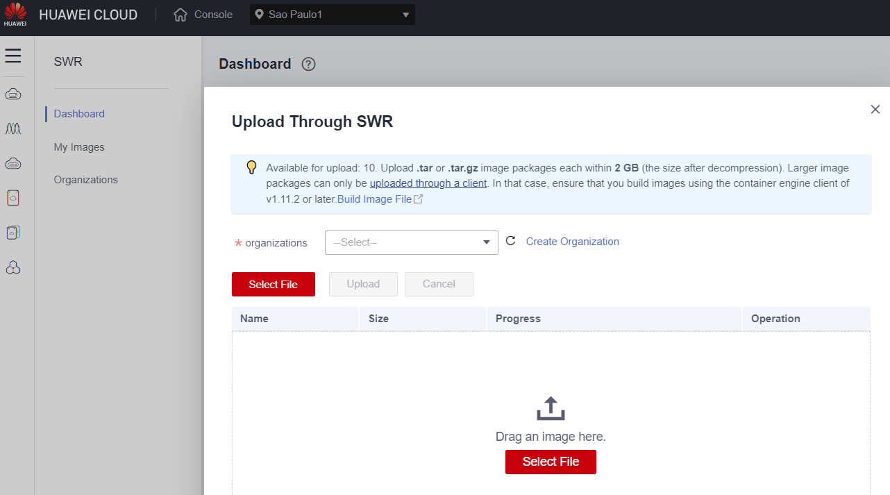
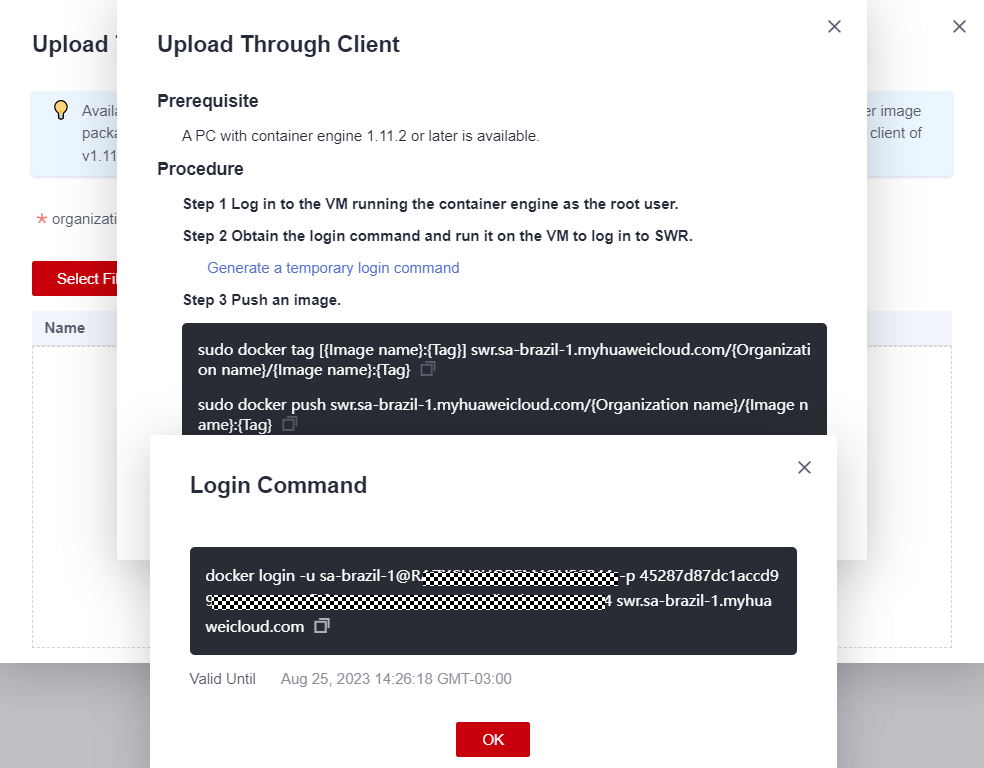
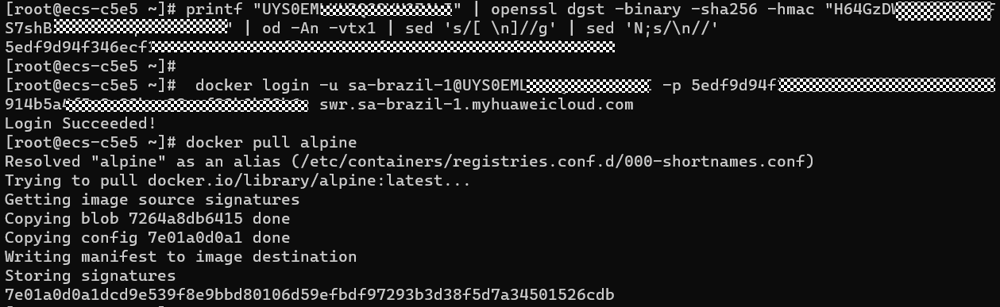
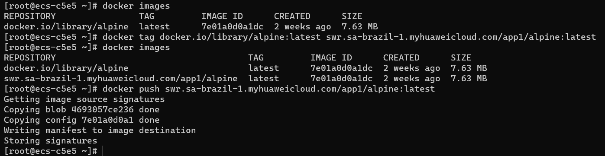
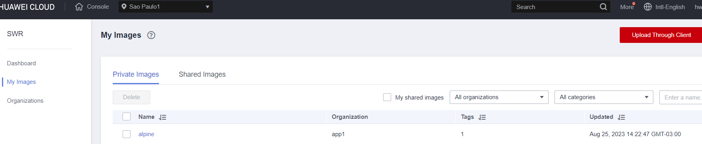

# SWR Container Registry

SoftWare Repository for Container (SWR) allows you to easily manage the full lifecycle of container images and facilitates secure deployment of images for your applications.

There are three ways to upload an image.

1. Through the GUI interface of the SWR service
2. Generate a templorary login command and upload
3. Obtaining a Long-Term Valid Login Command

**Method 1**

We can save a docker image use `docker save` command, and then we can upload this tar file to SWR.

```bash
[root@ecs-c5e5 ~]# docker images
REPOSITORY    TAG       IMAGE ID       CREATED        SIZE
hello-world   latest    9c7a54a9a43c   3 months ago   13.3kB
[root@ecs-c5e5 ~]# docker save hello-world:latest > hello-world.tar
```



**Method 2**

The provisional certification is only valid for a few hours.



**Method 3**

Login the huaweicloud account > Identity and Access Management > Users > Security Settings > Access Keys  > Create Access key

```bash
# Use this command, you will get a Long-Term Valid Login key
printf "AK" | openssl dgst -binary -sha256 -hmac "SK" | od -An -vtx1 | sed 's/[ \n]//g' | sed 'N;s/\n//'

# Usage Example
printf "RVHVMX******" | openssl dgst -binary -sha256 -hmac "H3nPwzgZ******" | od -An -vtx1 | sed 's/[ \n]//g' | sed 'N;s/\n//'
docker login -u ap-southeast-3@RVHVMX****** -p cab4ceab4a1545*************** swr.ap-southeast-3.myhuaweicloud.com
```

[Obtaining a Long-Term Valid Login Command](https://support.huaweicloud.com/intl/en-us/usermanual-swr/swr_01_1000.html)


## Show a Demo 


#### Install Docker

```bash
yum remove docker \
        docker-client \
        docker-client-latest \
        docker-common \
        docker-latest \
        docker-latest-logrotate \
        docker-logrotate \
        docker-engine

yum install -y yum-utils
yum-config-manager --add-repo https://download.docker.com/linux/centos/docker-ce.repo

yum install docker-ce docker-ce-cli containerd.io docker-buildx-plugin docker-compose-plugin

systemctl start docker && systemctl enable docker
```

#### Generate a long-term password

Get the long-term password and login，then we can download image or build image push to SWR



Modify the tag and push the image



We can login the huaweicloud conosle for check


