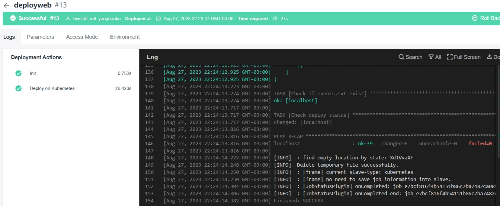

# CodeArts + CCE: From code to Application

CodeArts is a one-stop, full-process, secure, and trustworthy cloud-native DevSecOps platform. It's provide many services.I select some service's components to demonstrate how to quickly implement CI/CD capabilities through codearts and deploy code to CCE.

!!!note

    The steps is: source code --> build ---> package to docker image --> push to swr --> deploy to CCE 


## A Java web app build

### 1. create code repository

1. open the codearts console, create a project 
1. Go to the code --> Repo --> New Repository


- We can create a empty repository , and then use git command push code to this repository. 
- we can create repository use template


We are select a template for demo in there.

### 2. create dockerfile

create a dockerfile for package the application to image when CI(continuous integration) step build the source code finished. 

```dockerfile
FROM openjdk:8-jdk-alpine
ARG JAR_FILE=target/*.jar
COPY ${JAR_FILE} app.jar
ENTRYPOINT ["java","-jar","/app.jar"]
```

### 3. Build steps

Go to CI/CD option, select build step --> create task


Next step have a lot of Build Templates can select. choice the blank template, added two steps for the build task.


> Note: We can added more steps if we want more tasks for build.

Build and Running 


So we can see it's successful build the source code to jar file --> package to docker image --> upload to SWR.


 
## A Java web app deploy

create deploy.yaml file:

```yaml
apiVersion: apps/v1
kind: Deployment
metadata:
  annotations:
    description: ''
  labels:
    appgroup: ''
    version: v1
  name: javawebtest
  namespace: default
spec:
  selector:
    matchLabels:
      app: javawebtest
      version: v1
  template:
    metadata:
      annotations:
        metrics.alpha.kubernetes.io/custom-endpoints: '[{"api":"","path":"","port":"","names":""}]'
      labels:
        app: javawebtest
        version: v1
    spec:
      containers:
        - image: swr.sa-brazil-1.myhuaweicloud.com/devcloud/demo:v1
          name: container-0
          resources:
            requests:
              cpu: 250m
              memory: 512Mi
            limits:
              cpu: 1000m
              memory: 1024Mi
      imagePullSecrets:
        - name: default-secret
      terminationGracePeriodSeconds: 30
  replicas: 1
  minReadySeconds: 0
  strategy:
    type: RollingUpdate
    rollingUpdate:
      maxSurge: 0
      maxUnavailable: 1

---
apiVersion: v1
kind: Service
metadata:
  name: javawebtest
  labels:
    app: javawebtest
  namespace: default
  annotations: {}
spec:
  selector:
    app: javawebtest
  externalTrafficPolicy: Cluster
  ports:
    - name: cce-service-0
      targetPort: 8080
      nodePort: 0
      port: 8080
      protocol: TCP
  type: NodePort
```


### 1. CodeArts deploy

Switch to deploy option, and create a new task about deploy to CCE, setting like this:


This is the details informations 



Let's switch the CCE console check the workload, we found the application had deployed.  


### 2. CodeArts pipeline 

We can create a pipeline to combine the preceding two operations. And then We can deploy from source code to application with just click 1 time. 


Let's delete the CCE workload, try it again. we can check the service to CCE.

