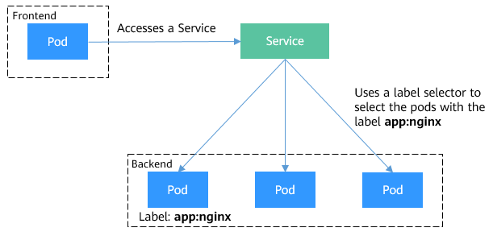

## 1. Service Types and Application Scenarios

Services of the ClusterIP, NodePort, LoadBalancer, and Headless Service types offer different functions.

- ClusterIP: used to make the Service only reachable within a cluster.
- NodePort: used for access from outside a cluster. A NodePort Service is accessed through the port on the node. For details, see [NodePort Services](https://support.huaweicloud.com/intl/en-us/basics-cce/kubernetes_0024.html#kubernetes_0024__section1175215413159).
- LoadBalancer: used for access from outside a cluster. It is an extension of NodePort, to which a load balancer routes, and external systems only need to access the load balancer. For details, see [LoadBalancer Services](https://support.huaweicloud.com/intl/en-us/basics-cce/kubernetes_0024.html#kubernetes_0024__section7151144411279).
- Headless Service: used by pods to discover each other. No separate cluster IP address will be allocated to this type of Service, and the cluster will not balance loads or perform routing for it. You can create a headless Service by setting the **spec.clusterIP** value to **None**. For details, see [Headless Services](https://support.huaweicloud.com/intl/en-us/basics-cce/kubernetes_0024.html#kubernetes_0024__section10301171915541).

we can use kubectl expose command setting this, And we can setting use console also.

```bash
# When using the NodePort type, the port here is meaningless. When accessing through a node, you need to actually view the corresponding NodePort. 
# This port parameter is only use for internal access when set the nodeport 
kubectl expose deployment deployment-name --port=30080 --target-port=80 --name=service-name --type=NodePort
kubectl expose --type=NodePort deployment nginx --port 80 --name nginx-nodeport  --overrides '{ "apiVersion": "v1","spec":{"ports": [{"port":80,"protocol":"TCP","targetPort":80,"nodePort":30080}]}}'

kubectl expose deployment deployment-name --port=80 --target-port=80 --name=service-name --type=ClusterIP
kubectl expose deployment hello-world --port 80 --type=LoadBalancer

# we can create a service and modify the selector 
kubectl create service nodeport myservice --node-port=31000 --tcp=3000:80
```
 

## Manage clusters via console or commands

We can see the Cluster Information --> Resources --> Connection Information --> kubectl, And then get the more details informations about configure kubectl.




When we finished all the steps, we can use commands operate the CCE cluster:

```bash
[root@ecs-c5e5 ~]# kubectl get ns
NAME              STATUS   AGE
default           Active   32h
kube-node-lease   Active   32h
kube-public       Active   32h
kube-system       Active   32h
```

Kubectl autocomplete

```bash
[root@ecs-c5e5 ~]# yum -y install bash-completion
[root@ecs-c5e5 ~]# source <(kubectl completion bash)
[root@ecs-c5e5 ~]# echo "source <(kubectl completion bash)" >> ~/.bashrc
```

You can also use a shorthand alias for kubectl that also works with completion:

```bash
alias k=kubectl
complete -o default -F __start_kubectl k
```

### ClusterIP

```bash
[root@ecs-c5e5 ~]# kubectl apply -f nginx.yaml -f tomcat.yaml
deployment.apps/nginx created
deployment.apps/tomcat created
[root@ecs-c5e5 ~]# kubectl expose deployment nginx --type=ClusterIP --name=nginx-service --port=80 --target-port=80
service/nginx-service exposed
[root@ecs-c5e5 ~]#
[root@ecs-c5e5 ~]# kubectl get pods -o wide
NAME                      READY   STATUS    RESTARTS   AGE    IP            NODE             NOMINATED NODE   READINESS GATES
nginx-698c667dd7-zrnrx    1/1     Running   0          2m8s   172.16.0.13   192.168.34.211   <none>           <none>
tomcat-77b6db4bdd-x295j   1/1     Running   0          2m8s   172.16.0.12   192.168.34.211   <none>           <none>
[root@ecs-c5e5 ~]# kubectl get svc -o wide
NAME            TYPE        CLUSTER-IP       EXTERNAL-IP   PORT(S)        AGE   SELECTOR
kubernetes      ClusterIP   10.247.0.1       <none>        443/TCP        33h   <none>
nginx-service   ClusterIP    10.247.156.240   <none>        80:80/TCP   36s   app=nginx
[root@ecs-c5e5 ~]# kubectl get endpoints
NAME            ENDPOINTS             AGE
kubernetes      192.168.34.240:5444   33h
nginx-service   172.16.0.13:80        49s
[root@ecs-c5e5 ~]# kubectl scale deployment nginx --replicas=2
deployment.apps/nginx scaled
[root@ecs-c5e5 ~]# kubectl get endpoints
NAME            ENDPOINTS                       AGE
kubernetes      192.168.34.240:5444             33h
nginx-service   172.16.0.13:80,172.16.0.14:80   64s
```

Access test like this:

```bash
[root@ecs-c5e5 ~]# kubectl exec -it tomcat-77b6db4bdd-x295j -- /bin/bash
root@tomcat-77b6db4bdd-x295j:/usr/local/tomcat#

# Access USE Pod IP 
root@tomcat-77b6db4bdd-x295j:/usr/local/tomcat# curl 172.16.0.13
<!DOCTYPE html>
<html>
<head>
<title>Welcome to nginx!</title>
<style>
html { color-scheme: light dark; }
body { width: 35em; margin: 0 auto;
font-family: Tahoma, Verdana, Arial, sans-serif; }
</style>
</head>
<body>
<h1>Welcome to nginx!</h1>
<p>If you see this page, the nginx web server is successfully installed and
working. Further configuration is required.</p>

<p>For online documentation and support please refer to
<a href="http://nginx.org/">nginx.org</a>.<br/>
Commercial support is available at
<a href="http://nginx.com/">nginx.com</a>.</p>

<p><em>Thank you for using nginx.</em></p>
</body>
</html>

# Access use ClusterIP
root@tomcat-77b6db4bdd-x295j:/usr/local/tomcat# curl 10.247.156.240
<!DOCTYPE html>
<html>
<head>
<title>Welcome to nginx!</title>
<style>
html { color-scheme: light dark; }
body { width: 35em; margin: 0 auto;
font-family: Tahoma, Verdana, Arial, sans-serif; }
</style>
</head>
<body>
<h1>Welcome to nginx!</h1>
<p>If you see this page, the nginx web server is successfully installed and
working. Further configuration is required.</p>

<p>For online documentation and support please refer to
<a href="http://nginx.org/">nginx.org</a>.<br/>
Commercial support is available at
<a href="http://nginx.com/">nginx.com</a>.</p>

<p><em>Thank you for using nginx.</em></p>
</body>
</html>

# Access use service name
root@tomcat-77b6db4bdd-x295j:/usr/local/tomcat# curl nginx-service
<!DOCTYPE html>
<html>
<head>
<title>Welcome to nginx!</title>
<style>
html { color-scheme: light dark; }
body { width: 35em; margin: 0 auto;
font-family: Tahoma, Verdana, Arial, sans-serif; }
</style>
</head>
<body>
<h1>Welcome to nginx!</h1>
<p>If you see this page, the nginx web server is successfully installed and
working. Further configuration is required.</p>

<p>For online documentation and support please refer to
<a href="http://nginx.org/">nginx.org</a>.<br/>
Commercial support is available at
<a href="http://nginx.com/">nginx.com</a>.</p>

<p><em>Thank you for using nginx.</em></p>
</body>
</html>

# Access use Domain
root@tomcat-77b6db4bdd-x295j:/usr/local/tomcat# cat /etc/resolv.conf
search default.svc.cluster.local svc.cluster.local cluster.local
nameserver 10.247.3.10
options ndots:5 timeout:2 single-request-reopen
root@tomcat-77b6db4bdd-x295j:/usr/local/tomcat# curl nginx-service.default.svc.cluster.local
<!DOCTYPE html>
<html>
<head>
<title>Welcome to nginx!</title>
<style>
html { color-scheme: light dark; }
body { width: 35em; margin: 0 auto;
font-family: Tahoma, Verdana, Arial, sans-serif; }
</style>
</head>
<body>
<h1>Welcome to nginx!</h1>
<p>If you see this page, the nginx web server is successfully installed and
working. Further configuration is required.</p>

<p>For online documentation and support please refer to
<a href="http://nginx.org/">nginx.org</a>.<br/>
Commercial support is available at
<a href="http://nginx.com/">nginx.com</a>.</p>

<p><em>Thank you for using nginx.</em></p>
</body>
</html>
```

### nodeport


```bash
[root@ecs-c5e5 ~]# kubectl get svc nginx-service -o yaml
apiVersion: v1
kind: Service
metadata:
  creationTimestamp: "2023-08-27T05:13:44Z"
  labels:
    app: nginx
  name: nginx-service
  namespace: default
  resourceVersion: "86260"
  uid: fac3c03a-fb5d-4341-812f-cff661c9ebe2
spec:
  clusterIP: 10.247.156.240
  clusterIPs:
  - 10.247.156.240
  externalTrafficPolicy: Cluster
  internalTrafficPolicy: Cluster
  ipFamilies:
  - IPv4
  ipFamilyPolicy: SingleStack
  ports:
  - nodePort: 31428
    port: 80
    protocol: TCP
    targetPort: 80
  selector:
    app: nginx
  sessionAffinity: None
  type: NodePort
status:
  loadBalancer: {}
```

### loadbalancer


```bash
[root@ecs-c5e5 ~]# kubectl get service
NAME         TYPE           CLUSTER-IP       EXTERNAL-IP                     PORT(S)           AGE
kubernetes   ClusterIP      10.247.0.1       <none>                          443/TCP           47h
nginx        ClusterIP      10.247.80.80     <none>                          80/TCP            13h
nginx-elb    LoadBalancer   10.247.155.17    110.238.103.45,192.168.34.190   80:32337/TCP      3m24s
nginx-node   NodePort       10.247.183.147   <none>                          30080:32180/TCP   13h
[root@ecs-c5e5 ~]# kubectl get svc nginx-elb -o yaml
apiVersion: v1
kind: Service
metadata:
  annotations:
    kubernetes.io/elb.autocreate: '{"name":"elb-test","type":"public","bandwidth_name":"cce-bandwidth-1693163374519","bandwidth_chargemode":"traffic","bandwidth_size":5,"bandwidth_sharetype":"PER","eip_type":"5_bgp"}'
    kubernetes.io/elb.class: union
    kubernetes.io/elb.eip-id: fba071e4-58aa-407a-bf00-4f5fc28cd73d
    kubernetes.io/elb.health-check-flag: "on"
    kubernetes.io/elb.health-check-option: '{"protocol":"TCP","delay":"5","timeout":"10","max_retries":"3"}'
    kubernetes.io/elb.id: a68106b8-f754-4369-8618-af21e8143dc3
    kubernetes.io/elb.lb-algorithm: ROUND_ROBIN
    kubernetes.io/elb.mark: "0"
  creationTimestamp: "2023-08-27T19:10:37Z"
  finalizers:
  - service.kubernetes.io/load-balancer-cleanup
  labels:
    app: nginx
  name: nginx-elb
  namespace: default
  resourceVersion: "119775"
  uid: 53191067-b9aa-4cc3-84df-ec4d5cbada74
spec:
  allocateLoadBalancerNodePorts: true
  clusterIP: 10.247.155.17
  clusterIPs:
  - 10.247.155.17
  externalTrafficPolicy: Cluster
  internalTrafficPolicy: Cluster
  ipFamilies:
  - IPv4
  ipFamilyPolicy: SingleStack
  loadBalancerIP: 110.238.103.45
  ports:
  - name: cce-service-0
    nodePort: 32337
    port: 80
    protocol: TCP
    targetPort: 80
  selector:
    app: nginx
  sessionAffinity: None
  type: LoadBalancer
status:
  loadBalancer:
    ingress:
    - ip: 110.238.103.45
    - ip: 192.168.34.190
```

[loadbalancer](https://support.huaweicloud.com/intl/en-us/usermanual-cce/cce_10_0681.html)

[service](https://support.huaweicloud.com/intl/en-us/basics-cce/kubernetes_0024.html)


## 2. ELB Ingress & Nginx Ingress

### ELB Ingress 


Access use the domain:


### Nginx Ingress 

Install the nginx-ingress plug-in and create a policy:


Because we didnot have the domain, so we can add the hosts record to verify. we need add the DNS A record if we have a real domain.

```bash
[root@ecs-c5e5 ~]# cat /etc/hosts
::1     localhost       localhost.localdomain   localhost6      localhost6.localdomain6
127.0.0.1       localhost       localhost.localdomain   localhost4      localhost4.localdomain4
127.0.0.1       ecs-c5e5        ecs-c5e5
110.238.103.45 www.abc.com
110.238.103.45 java.abc.com
[root@ecs-c5e5 ~]# curl -I java.abc.com
HTTP/1.1 200
Date: Mon, 28 Aug 2023 11:41:41 GMT
Content-Type: text/html;charset=UTF-8
Content-Length: 3084
Connection: keep-alive
Last-Modified: Mon, 28 Aug 2023 01:01:15 GMT
Accept-Ranges: bytes
Content-Language: en-US

[root@ecs-c5e5 ~]# curl www.abc.com
<!DOCTYPE html>
<html>
<head>
<title>Welcome to nginx!</title>
<style>
html { color-scheme: light dark; }
body { width: 35em; margin: 0 auto;
font-family: Tahoma, Verdana, Arial, sans-serif; }
</style>
</head>
<body>
<h1>Welcome to nginx!</h1>
<p>If you see this page, the nginx web server is successfully installed and
working. Further configuration is required.</p>

<p>For online documentation and support please refer to
<a href="http://nginx.org/">nginx.org</a>.<br/>
Commercial support is available at
<a href="http://nginx.com/">nginx.com</a>.</p>

<p><em>Thank you for using nginx.</em></p>
</body>
</html>
```


[Ingress](https://support.huaweicloud.com/intl/en-us/basics-cce/kubernetes_0025.html)

