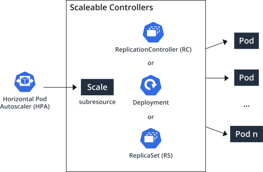
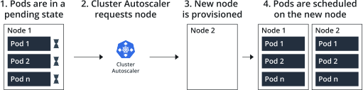
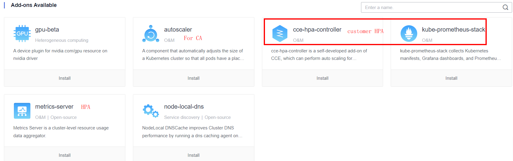
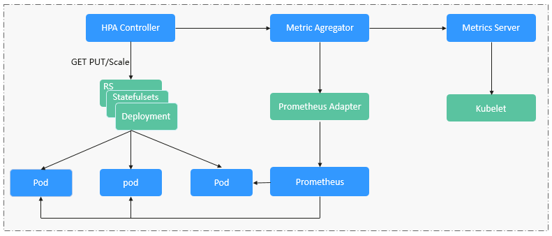
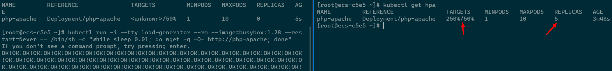
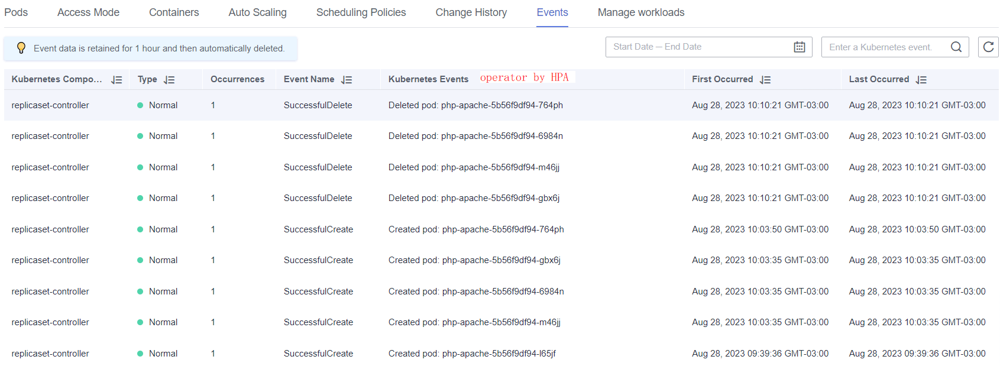
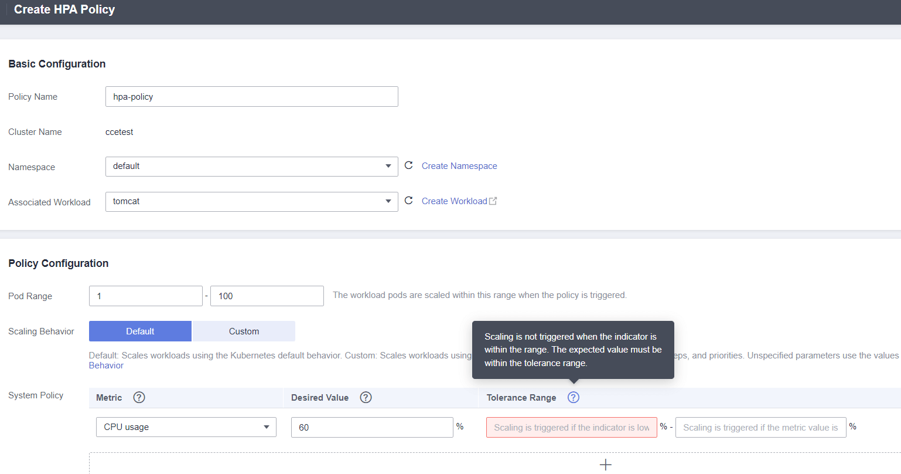
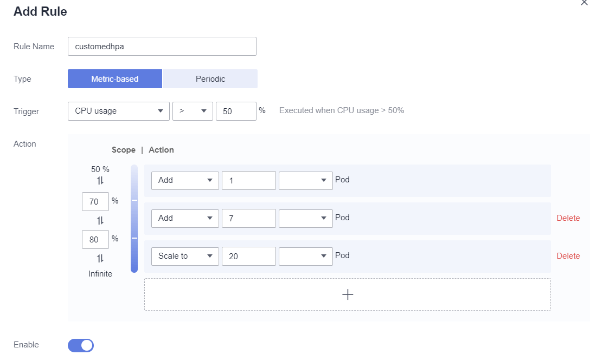
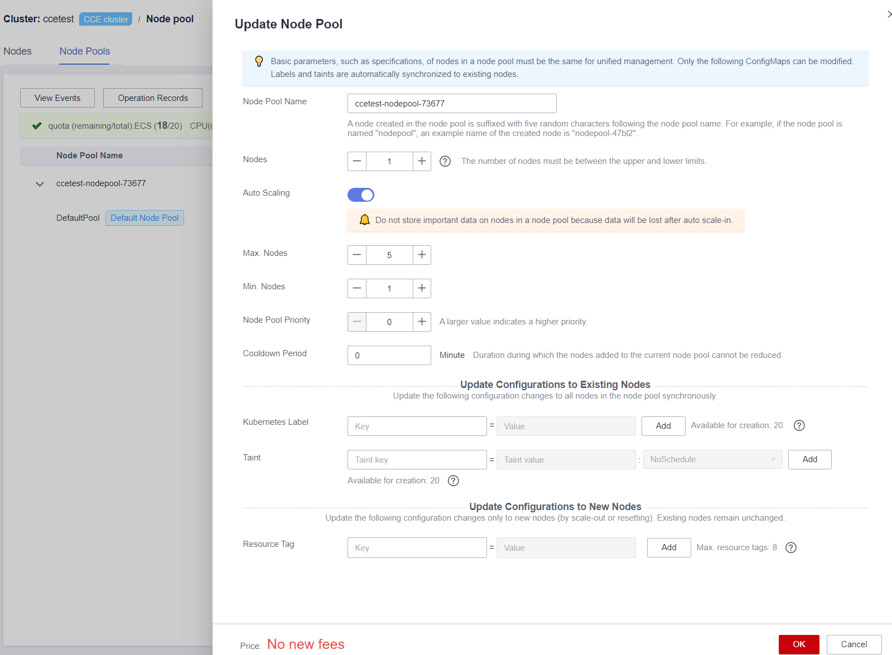
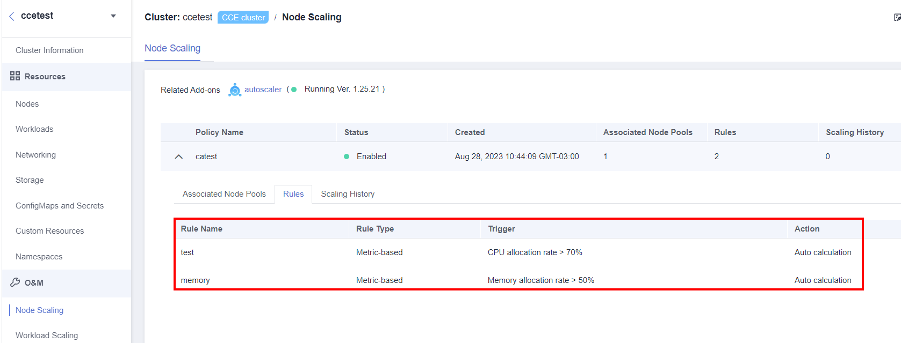

## Prerequisites

HPA(HorizontalPodAutoscaler) can increase and decrease pods according to policies.



When the node resources under the cluster are insufficient or wasted, CA can increase and decrease Node according to the policy.



To use HPA, you need to install an add-on that provides metrics APIs. Select one of the following add-ons based on your cluster version and actual requirements.

- [metrics-server](https://support.huaweicloud.com/intl/en-us/usermanual-cce/cce_10_0205.html): provides basic resource usage metrics, such as container CPU and memory usage. It is supported by all cluster versions.
- [kube-prometheus-stack](https://support.huaweicloud.com/intl/en-us/usermanual-cce/cce_10_0406.html): provides custom metrics in addition to basic resource metrics. You need to register Prometheus as the service that provides metrics API. For details, see [Providing Resource Metrics Through the Metrics API](https://support.huaweicloud.com/intl/en-us/usermanual-cce/cce_10_0406.html#cce_10_0406__section17830202915211). This add-on supports clusters of v1.17 or later.

Before using the node scaling function, you must install the [autoscaler](https://support.huaweicloud.com/intl/en-us/usermanual-cce/cce_10_0154.html) add-on of v1.13.8 or later.




## HPA(HorizontalPodAutoscaler) test

HPA mechanisim




Run a demo deployment（Run and expose php-apache server）

```yaml
apiVersion: apps/v1
kind: Deployment
metadata:
  name: php-apache
spec:
  selector:
    matchLabels:
      run: php-apache
  template:
    metadata:
      labels:
        run: php-apache
    spec:
      containers:
      - name: php-apache
        image: registry.k8s.io/hpa-example
        ports:
        - containerPort: 80
        resources:
          limits:
            cpu: 500m
          requests:
            cpu: 200m
---
apiVersion: v1
kind: Service
metadata:
  name: php-apache
  labels:
    run: php-apache
spec:
  ports:
  - port: 80
  selector:
    run: php-apache
```

[Resource Management for Pods and Containers](https://kubernetes.io/docs/concepts/configuration/manage-resources-containers/)

create the deployment

```bash
kubectl apply -f https://k8s.io/examples/application/php-apache.yaml
kubectl autoscale deployment php-apache --cpu-percent=50 --min=1 --max=10
kubectl get hpa

# Increase the load 
kubectl run -i --tty load-generator --rm --image=busybox:1.28 --restart=Never -- /bin/sh -c "while sleep 0.01; do wget -q -O- http://php-apache; done"

kubectl get hpa php-apache --watch
kubectl get deployment php-apache
```

Install the metrics-server plug-in, and add a loop access test to the corresponding load to mode high concurrent requests.



We can view the expansion and contraction process through the log.



Command operation is difficult for many people, but the graphical interface will be much simpler. CCE supports both command operation and easier click configuration through the web interface.



Huaweicloud CCE support customedHPA, we can set more step's actions.



[HorizontalPodAutoscaler Walkthrough](https://kubernetes.io/docs/tasks/run-application/horizontal-pod-autoscale-walkthrough/)

[Using HPA and CA for Auto Scaling of Workloads and Nodes](https://support.huaweicloud.com/intl/en-us/bestpractice-cce/cce_bestpractice_00282.html)


## CA（Cluster autoscaler）

Create a CCE nodepool, update enable the node pool autoscaling.  



Configure the node scaling rules: 



[Setting CA rules by yaml](https://support.huaweicloud.com/intl/en-us/usermanual-cce/cce_10_0209.html)

## Elastic Scaling of CCE Pods to CCI

[Elastic Scaling of CCE Pods to CCI](https://support.huaweicloud.com/intl/en-us/bestpractice-cce/cce_bestpractice_0133.html)

[Auto scaling](https://support.huaweicloud.com/intl/en-us/basics-cce/kubernetes_0034.html)