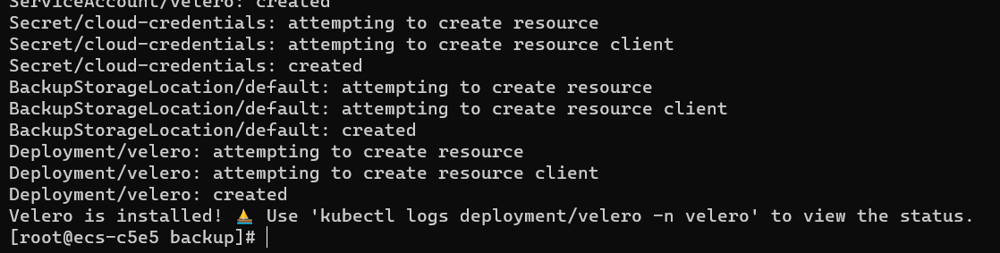
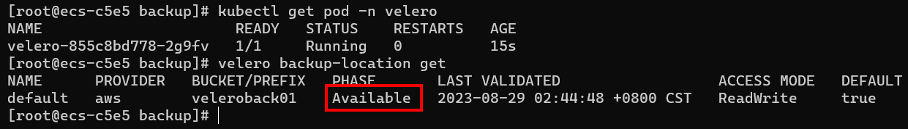
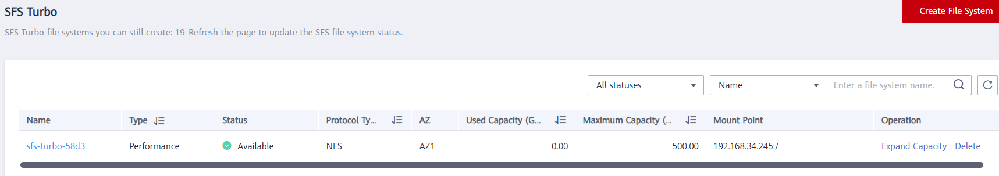
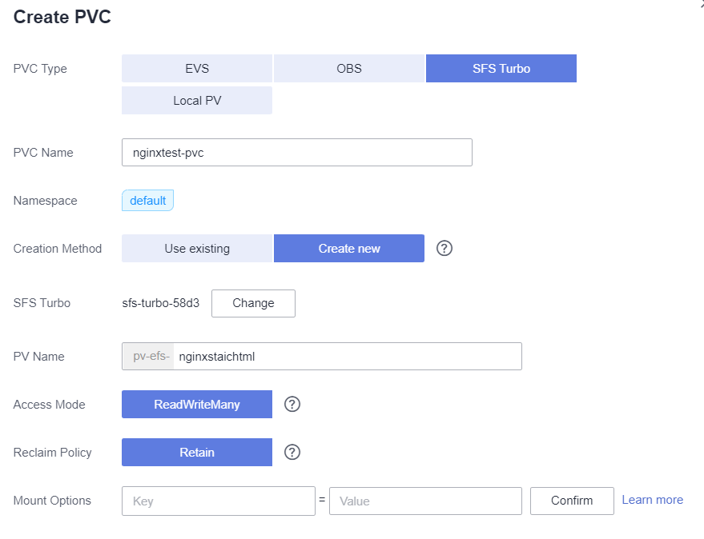
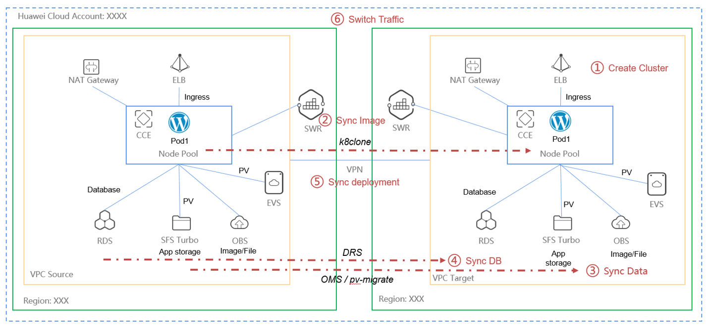

Backup and disaster recovery

## 1. Install the velero software

```bash
[root@ecs-c5e5 ~]# wget https://github.com/vmware-tanzu/velero/releases/download/v1.11.1/velero-v1.11.1-linux-amd64.tar.gz
[root@ecs-c5e5 ~]# tar zxvf velero-v1.11.1-linux-amd64.tar.gz
velero-v1.11.1-linux-amd64/LICENSE
velero-v1.11.1-linux-amd64/examples/minio/00-minio-deployment.yaml
velero-v1.11.1-linux-amd64/examples/nginx-app/README.md
velero-v1.11.1-linux-amd64/examples/nginx-app/base.yaml
velero-v1.11.1-linux-amd64/examples/nginx-app/with-pv.yaml
velero-v1.11.1-linux-amd64/velero
[root@ecs-c5e5 ~]# mv velero-v1.11.1-linux-amd64/velero /usr/local/bin/
```

create the AK/SK credentials file

```bash
# vim credentials-velero

[default]
aws_access_key_id = {AK}
aws_secret_access_key = {SK}
```

Currently, the S3 protocol is used in the industry, and HUAWEI CLOUD OBS also supports the S3 protocol. Therefore, set Provider to aws.

```bash
velero install \
  --provider aws \
  --plugins velero/velero-plugin-for-aws:v1.7.1 \
  --bucket veleroback01 \
  --secret-file ./credentials-velero \
  --use-volume-snapshots=false \
  --backup-location-config region=sa-brazil-1,s3ForcePathStyle="true",s3Url=http://obs.sa-brazil-1.myhuaweicloud.com
```

`veleroback01` is the OBS bucket name, we need create it in advance.



By default, a namespace named velero is created for the Velero instance. Run the following command to view the pod status:

```bash
$ kubectl get pod -n velero
```

Check the interconnection between Velero and the object storage and ensure that the status is Available.

```bash
$ velero backup-location get
```




## 2. create a application 

Create a nginx webapp and mount a SFS Turbo as the storage, the nginx access the page storage in SFS Turbo. 


```bash
[root@ecs-c5e5 ~]# kubectl exec -it nginx-685fcffdbf-lrh2x -- /bin/bash
root@nginx-685fcffdbf-lrh2x:/# df -h
Filesystem                     Size  Used Avail Use% Mounted on
overlay                         89G  2.5G   82G   3% /
tmpfs                           64M     0   64M   0% /dev
tmpfs                          7.6G     0  7.6G   0% /sys/fs/cgroup
shm                             64M     0   64M   0% /dev/shm
/dev/mapper/vgpaas-kubernetes  9.8G   63M  9.2G   1% /etc/hosts
/dev/mapper/vgpaas-dockersys    89G  2.5G   82G   3% /etc/hostname
192.168.34.245:/               500G     0  500G   0% /usr/share/nginx/html
tmpfs                          512M   12K  512M   1% /run/secrets/kubernetes.io/serviceaccount
tmpfs                          7.6G     0  7.6G   0% /proc/acpi
tmpfs                          7.6G     0  7.6G   0% /proc/scsi
tmpfs                          7.6G     0  7.6G   0% /sys/firmware
root@nginx-685fcffdbf-lrh2x:/# cd /usr/share/nginx/html/
root@nginx-685fcffdbf-lrh2x:/usr/share/nginx/html# ls
root@nginx-685fcffdbf-lrh2x:/usr/share/nginx/html# echo "111111" > index.html
root@nginx-685fcffdbf-lrh2x:/usr/share/nginx/html# echo "2222" > h1.html
root@nginx-685fcffdbf-lrh2x:/usr/share/nginx/html# exit
exit
[root@ecs-c5e5 ~]# curl 172.16.0.157
111111
[root@ecs-c5e5 ~]# curl 172.16.0.157/h1.html
2222
[root@ecs-c5e5 ~]# kubectl get  pods  -o wide
NAME                     READY   STATUS    RESTARTS   AGE    IP             NODE             NOMINATED NODE   READINESS GATES
nginx-685fcffdbf-lrh2x   1/1     Running   0          114s   172.16.0.157   192.168.34.204   <none>           <none>
nginx-685fcffdbf-tk2sw   1/1     Running   0          114s   172.16.0.20    192.168.34.211   <none>           <none>
[root@ecs-c5e5 ~]# curl 172.16.0.20
111111
```








[Installing the Migration Tool](https://support.huaweicloud.com/intl/en-us/bestpractice-cce/cce_bestpractice_0310.html)


### backup

Backup the nginx and delete the deployment, after this use the backup to restore. 

```bash
[root@ecs-c5e5 ~]# velero backup create backup20230828
Backup request "backup20230828" submitted successfully.
Run `velero backup describe backup20230828` or `velero backup logs backup20230828` for more details.
[root@ecs-c5e5 ~]# velero backup describe backup20230828
Name:         backup20230828
Namespace:    velero
Labels:       velero.io/storage-location=default
Annotations:  velero.io/source-cluster-k8s-gitversion=v1.25.3-r0-25.2.19
              velero.io/source-cluster-k8s-major-version=1
              velero.io/source-cluster-k8s-minor-version=25+

Phase:  Completed


Namespaces:
  Included:  *
  Excluded:  <none>

Resources:
  Included:        *
  Excluded:        <none>
  Cluster-scoped:  auto

Label selector:  <none>

Storage Location:  default

Velero-Native Snapshot PVs:  auto

TTL:  720h0m0s

CSISnapshotTimeout:    10m0s
ItemOperationTimeout:  1h0m0s

Hooks:  <none>

Backup Format Version:  1.1.0

Started:    2023-08-29 03:21:14 +0800 CST
Completed:  2023-08-29 03:21:23 +0800 CST

Expiration:  2023-09-28 03:21:14 +0800 CST

Total items to be backed up:  607
Items backed up:              607

Velero-Native Snapshots: <none included>
```

### restore


```bash
[root@ecs-c5e5 ~]# velero backup get
NAME             STATUS      ERRORS   WARNINGS   CREATED                         EXPIRES   STORAGE LOCATION   SELECTOR
backup20230828   Completed   0        0          2023-08-29 03:21:14 +0800 CST   29d       default            <none>
[root@ecs-c5e5 ~]# velero restore create --from-backup=backup20230828
Restore request "backup20230828-20230829032715" submitted successfully.
Run `velero restore describe backup20230828-20230829032715` or `velero restore logs backup20230828-20230829032715` for more details.
[root@ecs-c5e5 ~]# velero restore describe backup20230828-20230829032715
Name:         backup20230828-20230829032715
Namespace:    velero
Labels:       <none>
Annotations:  <none>

Phase:                                 InProgress
Estimated total items to be restored:  511
Items restored so far:                 87

Started:    2023-08-29 03:27:15 +0800 CST
Completed:  <n/a>

Backup:  backup20230828

Namespaces:
  Included:  all namespaces found in the backup
  Excluded:  <none>

Resources:
  Included:        *
  Excluded:        nodes, events, events.events.k8s.io, backups.velero.io, restores.velero.io, resticrepositories.velero.io, csinodes.storage.k8s.io, volumeattachments.storage.k8s.io, backuprepositories.velero.io
  Cluster-scoped:  auto

Namespace mappings:  <none>

Label selector:  <none>

Restore PVs:  auto

Existing Resource Policy:   <none>
ItemOperationTimeout:       1h0m0s

Preserve Service NodePorts:  auto

[root@ecs-c5e5 ~]# kubectl get pods
NAME                     READY   STATUS    RESTARTS   AGE
nginx-685fcffdbf-lrh2x   1/1     Running   0          8s
nginx-685fcffdbf-tk2sw   1/1     Running   0          7s
[root@ecs-c5e5 ~]# kubectl get pods -o wide
NAME                     READY   STATUS    RESTARTS   AGE   IP             NODE             NOMINATED NODE   READINESS GATES
nginx-685fcffdbf-lrh2x   1/1     Running   0          12s   172.16.0.158   192.168.34.204   <none>           <none>
nginx-685fcffdbf-tk2sw   1/1     Running   0          11s   172.16.0.21    192.168.34.211   <none>           <none>
[root@ecs-c5e5 ~]# curl 172.16.0.158
111111
```


> Note: If we need migrate the PV data, we can use the [pv-migrate](https://github.com/utkuozdemir/pv-migrate) tool for sync the PV data.

Another Choice: CBR, rsync, OMS and etc.  

## 3. Disaster Recovery

In a production environment, if you want to implement cross-region backup and recovery, you need to proceed as shown in the figure below.



If runing in the same region, it's easy then this digram.

For application High Availability, we can also use the UCS service manage mulit-cluster running application. 

[Disaster Recovery: Implementing High Availability for Containers in CCE](https://support.huaweicloud.com/intl/en-us/bestpractice-cce/cce_bestpractice_00220.html)

