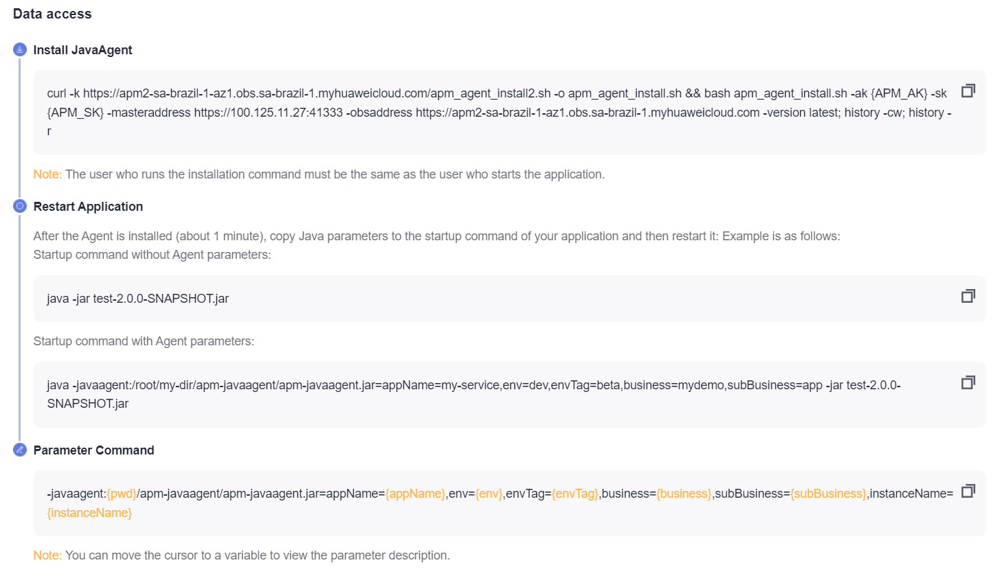
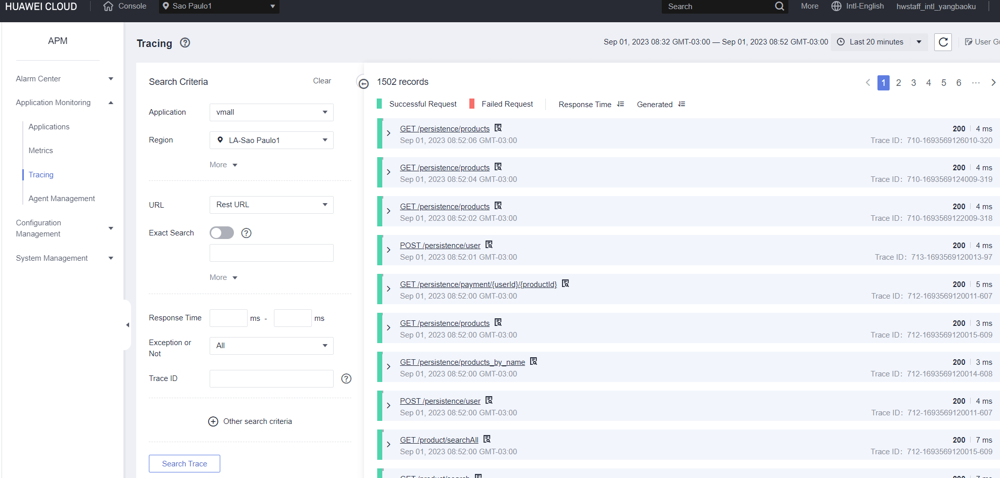
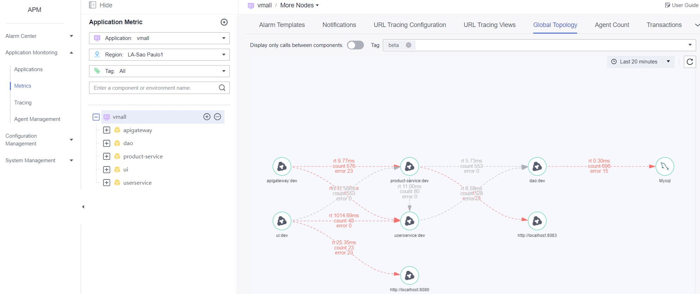
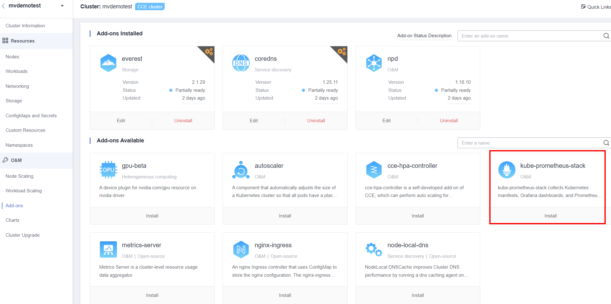
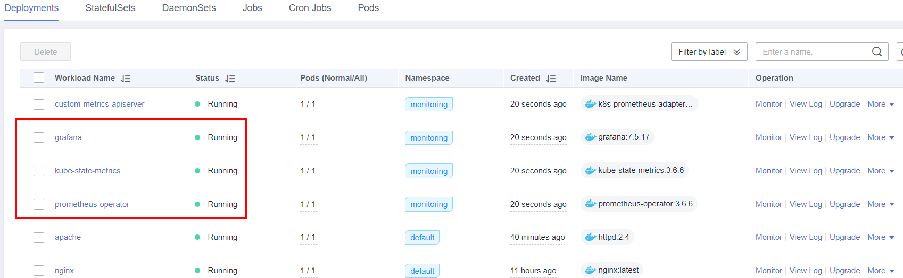

### AOM 


### APM 

Install the APM for host and start the application load the apm jar file.




Running a test application

```bash
[root@ecs-c5e5 testdemo]# cat startapm.sh
java -javaagent:/root/testdemo/apm-javaagent/apm-javaagent.jar=appName=dao,env=dev,envTag=beta,business=vmall -jar /root/testdemo/ecommerce-persistence-service-0.0.1-SNAPSHOT.jar --spring.config.location=file:/root/testdemo/application_dao.yml  > dao.log 2>&1 &
java -javaagent:/root/testdemo/apm-javaagent/apm-javaagent.jar=appName=apigateway,env=dev,envTag=beta,business=vmall -jar /root/testdemo/ecommerce-api-gateway-0.0.1-SNAPSHOT.jar --spring.config.location=file:/root/testdemo/application_api.yml  > api.log 2>&1 &
java -javaagent:/root/testdemo/apm-javaagent/apm-javaagent.jar=appName=userservice,env=dev,envTag=beta,business=vmall -jar /root/testdemo/ecommerce-user-service-0.0.1-SNAPSHOT.jar --spring.config.location=file:/root/testdemo/application_userservice.yml  > user.log 2>&1 &
java -javaagent:/root/testdemo/apm-javaagent/apm-javaagent.jar=appName=product-service,env=dev,envTag=beta,business=vmall -jar /root/testdemo/ecommerce-product-service-0.0.1-SNAPSHOT.jar --spring.config.location=file:/root/testdemo/application_prod.yml  > prod.log 2>&1 &
java -javaagent:/root/testdemo/apm-javaagent/apm-javaagent.jar=appName=ui,env=dev,envTag=beta,business=vmall -jar /root/testdemo/cloud-simple-ui-1.0.0.jar --spring.config.location=file:/root/testdemo/ui.properties > ui.log 2>&1 &
```

tracing 



Topology




### Prometheus

Easy integration installation through plug-in interface



prometheus-grafana


