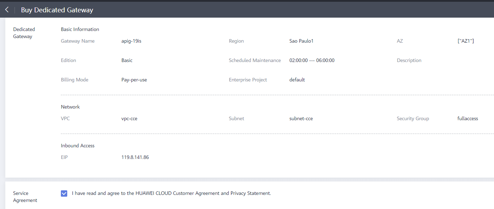
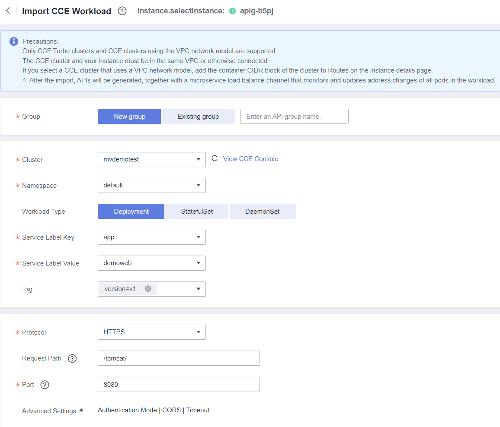
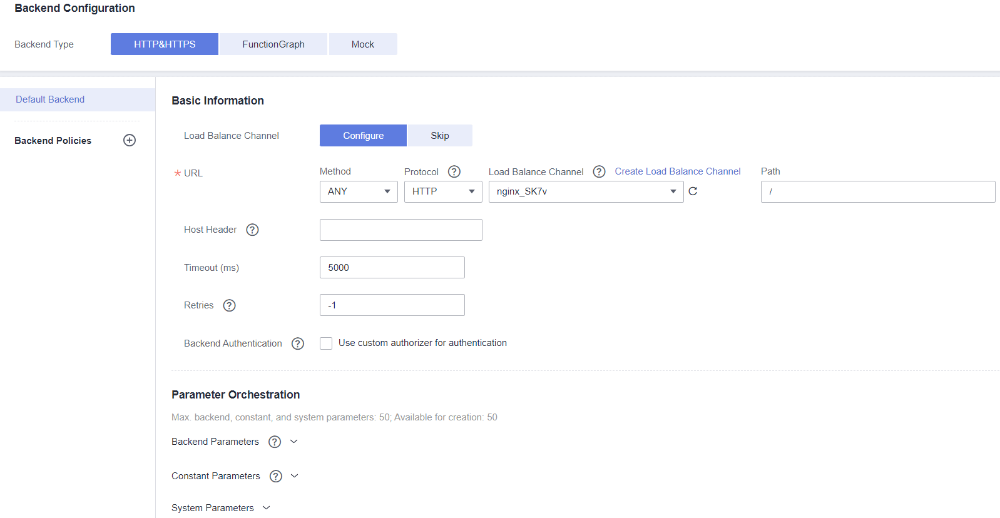
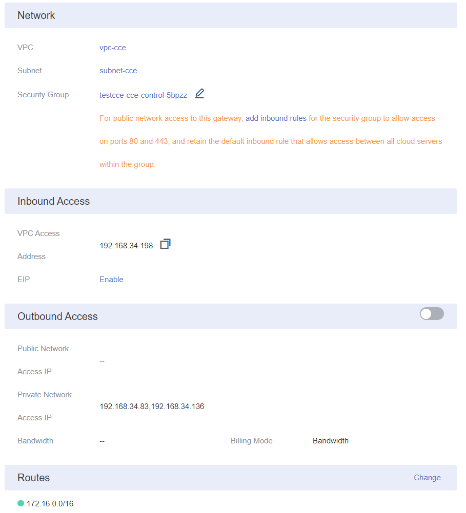
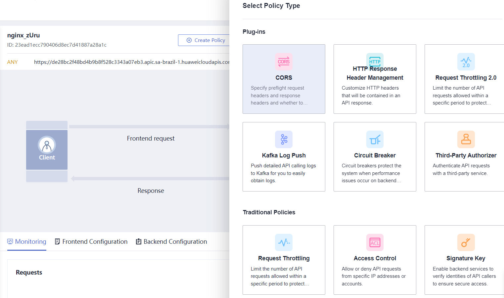
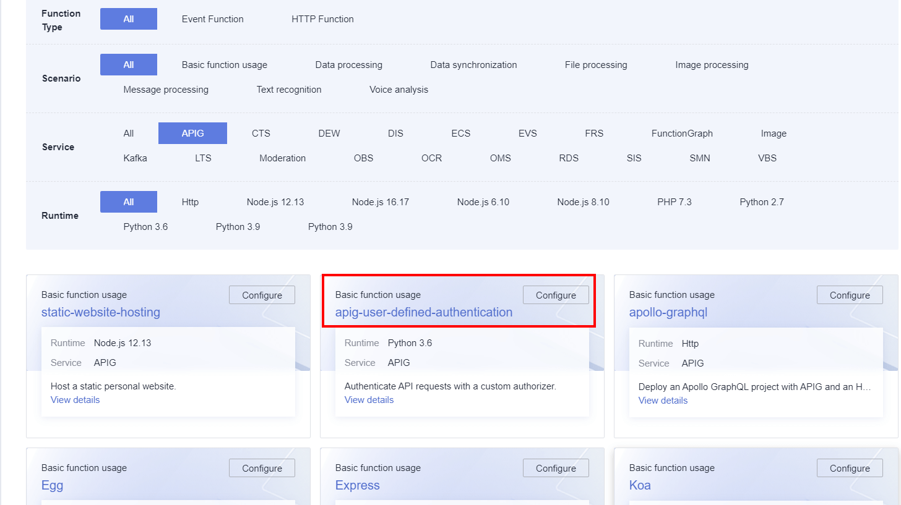
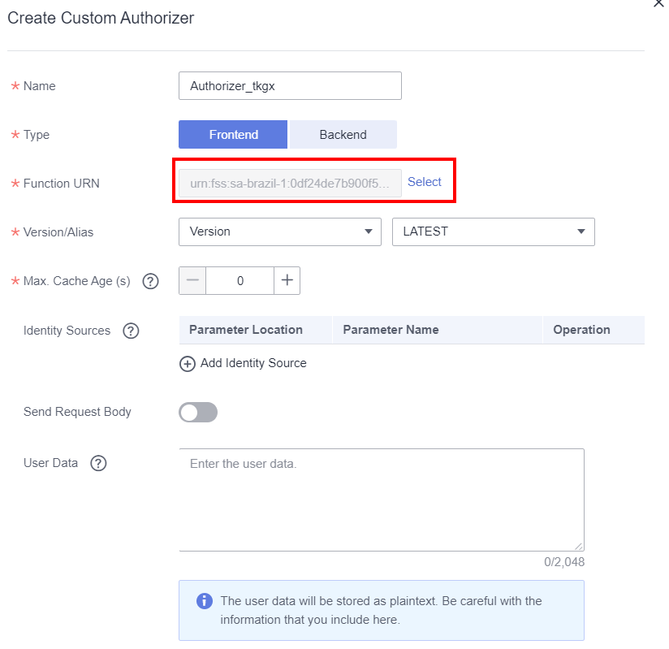
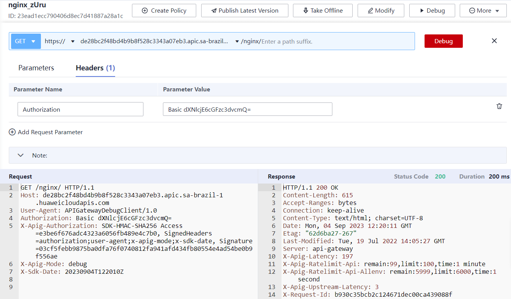

Let's look at the effect first, and then complete the configuration step by step.

### Configurate APIG + CCE workloads

Create the APIG step by step like this:



click `Gateway Information--> Basic Information --> Routes`  , Edit and add the container CIDR.

import CCE workload 



The backend configuration of APIG must be consistent with that of CCE workload.



If we want to access the publish APIG through the public network, this is need bind `Inbond Access` EIP. 

If need CCE workload access the outside, this is need open the outbound access permission. 



### APIG policy

You can select the corresponding plug-in to implement different functions. for example: Rate limit, IP block



**configurate authenticate**

create a function and integrate with APIG 



the python demo code like this：

```python
# -*- coding:utf-8 -*-
import json


def handler(event, context):
    if event["headers"].get("authorization") == 'Basic dXNlcjE6cGFzc3dvcmQ=':
        return {
            'statusCode': 200,
            'body': json.dumps({
                "status": "allow",
                "context": {
                    "user_name": "user1"
                }
            })
        }
    else:
        return {
            'statusCode': 200,
            'body': json.dumps({
                "status": "deny",
                "context": {
                    "code": "1001",
                    "message": "incorrect username or password"
                }
            })
        }
```

Follow this procedure to create `API Policies --> Custom Authorizers` 



let's debug the apis, if didn use authorize, you will recive this response:


```bash
HTTP/1.1 401 Unauthorized
Transfer-Encoding: chunked
Connection: keep-alive
Content-Type: application/json
Date: Mon, 04 Sep 2023 11:57:37 GMT
Server: api-gateway
X-Apig-Latency: 557
X-Request-Id: 822cf60eb35d5280fc83614b31e7b507

{"error_msg":"Incorrect authentication information: frontend authorizer","error_code":"APIG.0305","request_id":"822cf60eb35d5280fc83614b31e7b507"}
```

Add the authorzation header and requeste again



