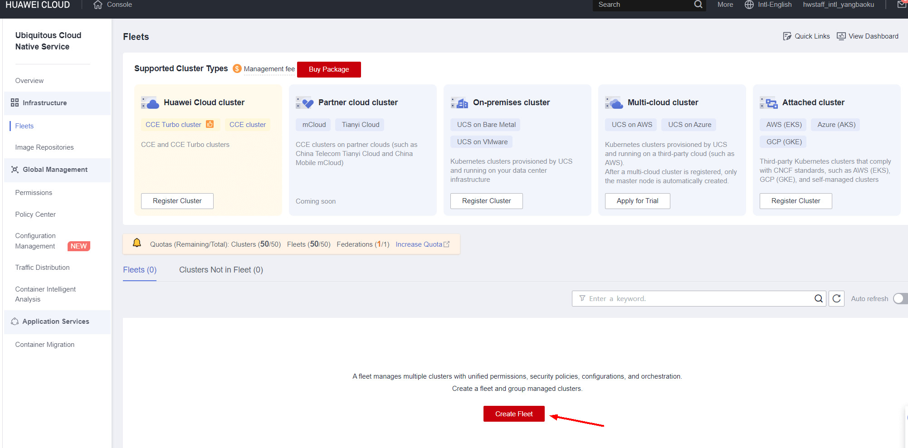
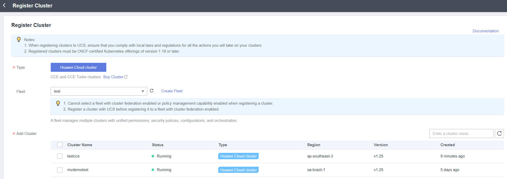
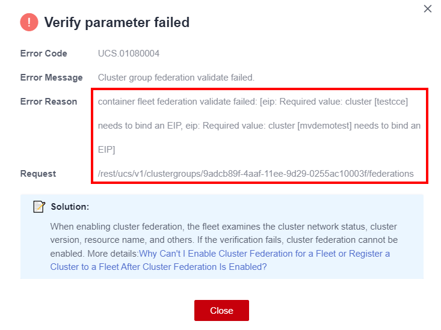
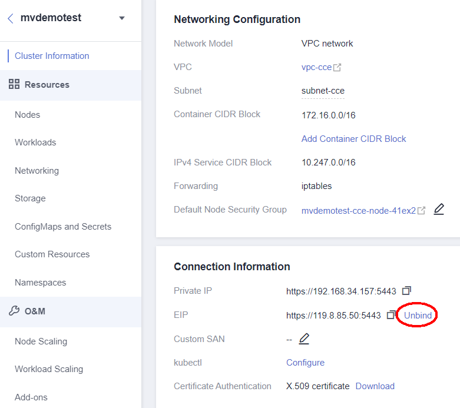
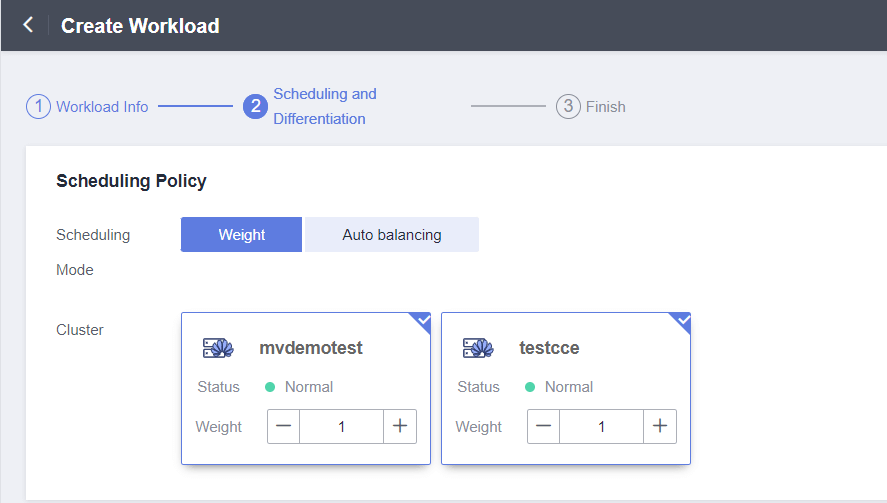
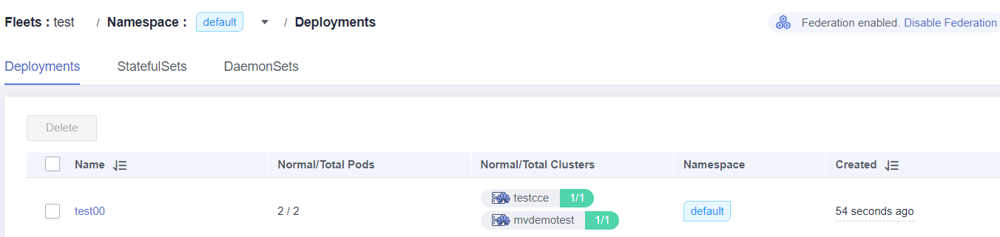

Create fleets

Rgister Cluster

Federation validate

If you can enable the Federation permission, the cce or k8s cluster must bind the EIP(Enable it to enjoy unified orchestration of multiple clusters, cross-cluster auto scaling & service discovery, auto failover, etc.)

Create Workload

create deployment 

And they we can try delete a pod from one cluster, You will find that after deletion, the corresponding pod will be recreated in the cluster. Because at this time the cluster will have UCS for scheduling.