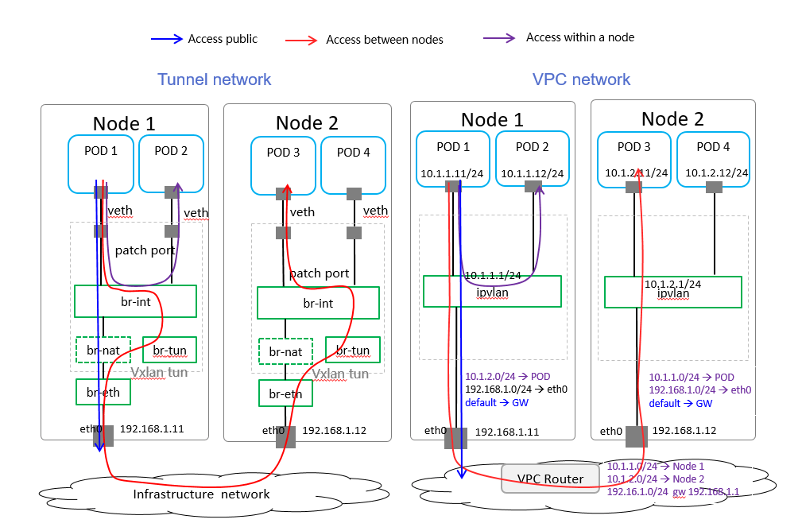
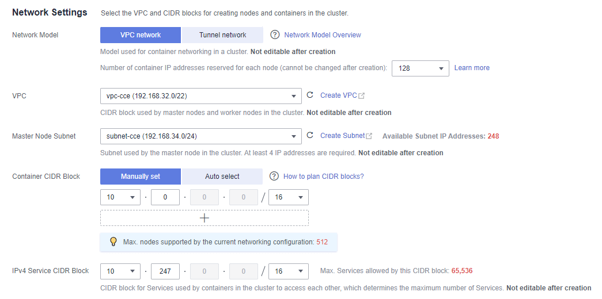
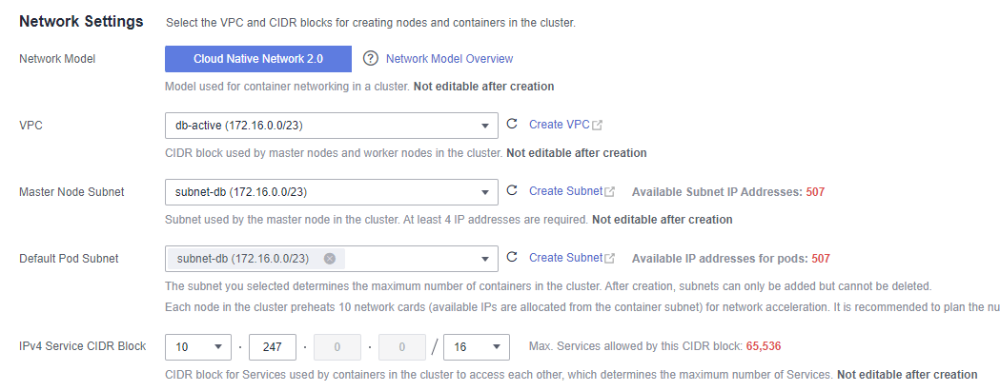

# Huaweicloud CCE network training

## 1. cce cluster network mode

The container network assigns IP addresses to pods in a cluster and provides networking services. In CCE, you can select the following network models for your cluster:

- [Tunnel network](https://support.huaweicloud.com/intl/en-us/usermanual-cce/cce_10_0282.html)
- [VPC network](https://support.huaweicloud.com/intl/en-us/usermanual-cce/cce_10_0283.html)
- [Cloud Native Network 2.0 - CCE Turbo ](https://support.huaweicloud.com/intl/en-us/usermanual-cce/cce_10_0284.html)

### Network Model Comparison

| Dimension    | Tunnel Network    | VPC Network      | Cloud Native Network 2.0     |
| ---------------------- | --------------- | ------------------- | ---------- |
| Application scenarios  | 1. Common container service scenarios   2. Scenarios that do not have high requirements on network latency and bandwidth    | 1. Scenarios that have high requirements on network latency and bandwidth    2. Containers can communicate with VMs using a microservice registration framework, such as Dubbo and CSE.     | 1. Scenarios that have high requirements on network latency, bandwidth, and performance    2. Containers can communicate with VMs using a microservice registration framework, such as Dubbo and CSE. |
| Core technology        | OVS       | IPvlan and VPC route            | VPC ENI/sub-ENI               |
| Applicable clusters    | CCE cluster       | CCE cluster         | CCE Turbo cluster      |
| Network isolation      | Kubernetes native NetworkPolicy for pods     | No       | Pods support security group isolation.        |
| Passthrough networking | No      | No          | Yes     |
| IP address management  | The container CIDR block is allocated separately.   CIDR blocks are divided by node and can be dynamically allocated (CIDR blocks can be dynamically added after being allocated.) | The container CIDR block is allocated separately.   CIDR blocks are divided by node and statically allocated (the CIDR block cannot be changed after a node is created).     | The container CIDR block is divided from the VPC subnet and does not need to be allocated separately.    |
| Network performance    | Performance loss due to VXLAN encapsulation       | No tunnel encapsulation. Cross-node packets are forwarded through VPC routers, delivering performance equivalent to that of the host network.     | The container network is integrated with the VPC network, eliminating performance loss.        |
| Networking scale       | A maximum of 2,000 nodes are supported.    | By default, 200 nodes are supported. Each time a node is added to the cluster, a route is added to the VPC route tables (including the default and custom ones). Therefore, the cluster scale is limited by the VPC route tables. | A maximum of 2,000 nodes are supported.        |

**performance: ENI > VPC > Tunnel**

**Number of network nodes: (ENI,Tunnel) > VPC**

Elastic Network Interfaces (ENIs) , Reference qingtian Architecture

> Note: After a cluster is created, the network model cannot be changed. 

[Offical link about network ](https://support.huaweicloud.com/intl/en-us/usermanual-cce/cce_10_0281.html)

The following figure shows the creation on the CCE GUI：

### CCE Turbo vs CCE

CCE Turbo is an enhancement of CCE.

<table cellpadding="4" cellspacing="0" summary="" id="cce_10_0342__en-us_topic_0000001151389047_table8289045224" frame="border" border="1" rules="all">
    <caption>
     <b>Table 1 </b>Cluster types
    </caption>
    <thead align="left">
     <tr id="cce_10_0342__en-us_topic_0000001151389047_row19289164182216">
      <th align="left" class="cellrowborder" valign="top" width="9.699030096990302%" id="mcps1.3.1.3.2.5.1.1">
Dimension
</th>
      <th align="left" class="cellrowborder" valign="top" width="12.218778122187782%" id="mcps1.3.1.3.2.5.1.2">
Sub-dimension
</th>
      <th align="left" class="cellrowborder" valign="top" width="40.965903409659035%" id="mcps1.3.1.3.2.5.1.3">
CCE Turbo Cluster
</th>
      <th align="left" class="cellrowborder" valign="top" width="37.11628837116288%" id="mcps1.3.1.3.2.5.1.4">
CCE Cluster
</th>
     </tr>
    </thead>
    <tbody>
     <tr id="cce_10_0342__en-us_topic_0000001151389047_row0378353192912">
      <td class="cellrowborder" rowspan="2" valign="top" width="9.699030096990302%" headers="mcps1.3.1.3.2.5.1.1 ">
Cluster
</td>
      <td class="cellrowborder" valign="top" width="12.218778122187782%" headers="mcps1.3.1.3.2.5.1.2 ">
Positioning
</td>
      <td class="cellrowborder" valign="top" width="40.965903409659035%" headers="mcps1.3.1.3.2.5.1.3 ">
Next-gen container cluster, with accelerated computing, networking, and scheduling. Designed for Cloud Native 2.0
</td>
      <td class="cellrowborder" valign="top" width="37.11628837116288%" headers="mcps1.3.1.3.2.5.1.4 ">
Standard cluster for common commercial use
</td>
     </tr>
     <tr id="cce_10_0342__en-us_topic_0000001151389047_row132892412218">
      <td class="cellrowborder" valign="top" headers="mcps1.3.1.3.2.5.1.1 ">
Node type
</td>
      <td class="cellrowborder" valign="top" headers="mcps1.3.1.3.2.5.1.2 ">
Hybrid deployment of VMs and bare-metal servers
</td>
      <td class="cellrowborder" valign="top" headers="mcps1.3.1.3.2.5.1.3 ">
Hybrid deployment of VMs and bare-metal servers
</td>
     </tr>
     <tr id="cce_10_0342__en-us_topic_0000001151389047_row19562502266">
      <td class="cellrowborder" rowspan="3" valign="top" width="9.699030096990302%" headers="mcps1.3.1.3.2.5.1.1 ">
Networking
</td>
      <td class="cellrowborder" valign="top" width="12.218778122187782%" headers="mcps1.3.1.3.2.5.1.2 ">
Model
</td>
      <td class="cellrowborder" valign="top" width="40.965903409659035%" headers="mcps1.3.1.3.2.5.1.3 ">
<strong id="cce_10_0342__en-us_topic_0000001151389047_b5222152982410">Cloud Native Network 2.0</strong>: applies to large-scale and high-performance scenarios.
 
Max networking scale: 2,000 nodes
</td>
      <td class="cellrowborder" valign="top" width="37.11628837116288%" headers="mcps1.3.1.3.2.5.1.4 ">
<strong id="cce_10_0342__en-us_topic_0000001151389047_b3481929453">Cloud-native network 1.0</strong>: applies to common, smaller-scale scenarios.

       <ul id="cce_10_0342__en-us_topic_0000001151389047_ul2055005123618">
        <li id="cce_10_0342__en-us_topic_0000001151389047_li10550155114368">Tunnel network model</li>
        <li id="cce_10_0342__en-us_topic_0000001151389047_li9550551123616">VPC network model</li>
       </ul></td>
     </tr>
     <tr id="cce_10_0342__en-us_topic_0000001151389047_row133581631175511">
      <td class="cellrowborder" valign="top" headers="mcps1.3.1.3.2.5.1.1 ">
Performance
</td>
      <td class="cellrowborder" valign="top" headers="mcps1.3.1.3.2.5.1.2 ">
Flattens the VPC network and container network into one. No performance loss.
</td>
      <td class="cellrowborder" valign="top" headers="mcps1.3.1.3.2.5.1.3 ">
Overlays the VPC network with the container network, causing certain performance loss.
</td>
     </tr>
     <tr id="cce_10_0342__en-us_topic_0000001151389047_row1328914432215">
      <td class="cellrowborder" valign="top" headers="mcps1.3.1.3.2.5.1.1 ">
Container network isolation
</td>
      <td class="cellrowborder" valign="top" headers="mcps1.3.1.3.2.5.1.2 ">
Associates pods with security groups. Unifies security isolation in and out the cluster via security groups' network policies.
</td>
      <td class="cellrowborder" valign="top" headers="mcps1.3.1.3.2.5.1.3 ">
       <ul id="cce_10_0342__en-us_topic_0000001151389047_ul29571941173617">
        <li id="cce_10_0342__en-us_topic_0000001151389047_li1595716411365">Tunnel network model: supports network policies for intra-cluster communications.</li>
        <li id="cce_10_0342__en-us_topic_0000001151389047_li16957541123611">VPC network model: supports no isolation.</li>
       </ul></td>
     </tr>
     <tr id="cce_10_0342__en-us_topic_0000001151389047_row17290144506">
      <td class="cellrowborder" valign="top" width="9.699030096990302%" headers="mcps1.3.1.3.2.5.1.1 ">
Security
</td>
      <td class="cellrowborder" valign="top" width="12.218778122187782%" headers="mcps1.3.1.3.2.5.1.2 ">
Isolation
</td>
      <td class="cellrowborder" valign="top" width="40.965903409659035%" headers="mcps1.3.1.3.2.5.1.3 ">
       <ul id="cce_10_0342__en-us_topic_0000001151389047_ul125981418125012">
        <li id="cce_10_0342__en-us_topic_0000001151389047_li159814182503">Physical machine: runs Kata containers, allowing VM-level isolation.</li>
        <li id="cce_10_0342__en-us_topic_0000001151389047_li1759813188506">VM: runs common containers, isolated by cgroups.</li>
       </ul></td>
      <td class="cellrowborder" valign="top" width="37.11628837116288%" headers="mcps1.3.1.3.2.5.1.4 ">
Runs common containers, isolated by cgroups.
</td>
     </tr>
    </tbody>
   </table>

[Offical link about CCE Turbo Clusters and CCE Clusters](https://support.huaweicloud.com/intl/en-us/usermanual-cce/cce_10_0342.html)

The following figure shows the creation on the CCE Turbo GUI：

### Ingress

An ingress is an independent resource in the Kubernetes cluster and defines rules for forwarding external access traffic. we can customize forwarding rules based on domain names and URLs to implement fine-grained distribution of access traffic.

[ELB Ingress & Nginx Ingress](https://support.huaweicloud.com/intl/en-us/usermanual-cce/cce_10_0094.html)
