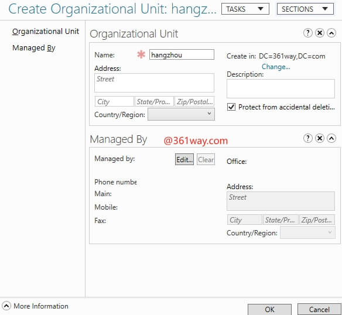

# ECS实例搭建Windows AD域

## 简介及规划

[活动目录AD（Active Directory）](https://learn.microsoft.com/en-us/windows-server/identity/ad-ds/get-started/virtual-dc/active-directory-domain-services-overview)是微软服务的核心组件。AD能实现高效管理，例如批量管理用户、部署应用和更新补丁等。许多微软组件（例如Exchange）和故障转移群集也需要AD域环境。由于很多企业一直都是通过AD来管理企业IT系统认证和权限的管理，所以很多邮箱系统、OA系统、云桌面办公等系统都免不了的需要了AD进行集成。本文以Windows Server 2019 standard 操作系统为例，介绍如何搭建AD域。

已创建两台ECS实例，分别作为域控制器（DC）和客户端（Client），创建的ECS实例分区需要为NTFS格式、支持DNS服务。以下为两台服务的规划：

| 规划 | IP | 名称                           |
| :---- | -------| ------------------------ |
| 服务端 | 192.168.1.250 | dc1.361way.com    |
| 客户端 | 192.168.1.100 | client.361way.com |

**Windows客户端加入AD域需要用到的端口**

    TCP 88（Kerberos密钥分发中心）
    TCP 135（远程过程调用）
    TCP 139（NetBIOS会话服务）
    TCP 389（LDAP）
    TCP 445（SMB，网络登录）
    UDP 53（DNS）
    UDP 389（LDAP，DC定位器，网络登录）
    TCP 49152-65535（随机分配的高TCP端口）

**AD域复制需要那些防火墙开放的端口**

    TCP 53（DNS）
    TCP 88（Kerberos密钥分发中心）
    TCP 135（远程过程调用）
    TCP 139（NetBIOS会话服务）
    TCP 389（LDAP）
    TCP 445（SMB，网络登录）
    TCP 464（Kerberos密码）
    TCP 3268（全球目录）
    TCP 49152 – 65535（随机分配的高端口）
    UDP 53（DNS）
    UDP 123（NTP）
    UDP 389（LDAP）
    UDP 445
    UDP 464

## AD服务器的部署

### 名词说明

活动目录AD（Active Directory）是微软服务的核心组件，相关名词概念如下：

- DC：Domain Controllers，域控制器
- DN：Distinguished Name，识别名
- OU：Organizational Unit，组织单位
- CN：Canonical Name，正式名称
- SID：Security Identifier，安全标识符
- SDP：Service principal names，服务主题名称
- FQDN：Fully qualified domain name，完全合格域名

本文以Windows Server 2019为例介绍如何搭建AD域。

### AD服务安装

登录云平台并创建第一台ECS服务器用于搭建AD域服务器，特别注意的是需要为服务器设置静态IP地址（默认一般都是VPC DHCP分配地址）。这里以华为云为例：

使用快捷键 `Windows + R` 打开运行，输入 `servermanager` 启动服务管理界面（或通过window开始菜单单选到服务管理器）：

在“添加角色和功能”向导中，转到左侧的安装类型面板并选择 `Role-based or feature-based installation` 并点击 `Next` 进入下一步

这里主机名我已修改为dc1，这里就选择这台服务器并下一步

对应的服务选择 `Active Directory Domain Services` 和 `DNS Server` 

等待到如下界面后，表示已完成相关组件的安装

### 配置AD服务

点击黄色的感叹号，选中 `Promote this server to a domain controller` 并点击会跳出部署配置界面：

增加一个新的林，这个输入对应的域名，我这里选择的是361way.com

下图这里会让输入域的管理员密码，不过这里有一个奇怪的地方，我使用的是win2019服务器版本，但域和林的功能等级这里显示的是win2016，估计是向下兼容的版本。

再后面都是一路的下一步就完了，创建DNS委派不用选，NetBIOS域名会自动输出。AD DS database, log files, and SYSVOL 对应的路径如下：

    Database folder: C:\Windows\NTDS
    Log files folder: C:\Windows\NTDS
    SYSVOL folder: C:\Windows\SYSVOL

安装完成后服务器会进行一次重启。

### 配置OU

OU 是 `organizational unit (OU)` 组织单元的缩写，对应的通常是一个总公司、分公司或者以城市命名的子属单位，设置为一个便于识别和管理的名称即可。通过在运行中输入 `dsac.exe` 命令或在启动栏查找 `ADAC(Active Directory Administrative Center)` 进入域管理界面。

选择对应的域并点选新建 organizational unit

给 OU 取个名字，如果你愿意的话也可以增加一些对应的描述

选用刚刚创建的 OU ，右键创建 user 

这里创建了一个用户张三，下面会有一些组织信息可以设置，比如邮箱、电话、职位等信息，这部分不是必选项，可写可不写。

在 `Global Search` 界面可以查找创建的用户并重建密码，默认重建密码后用户第一次登录必须修改密码。

修改完密码后，还需要 enable 用户。

## 客户端加入AD

由于一些云平台上的windows主机没有提供修改windows网卡配置的设置（修改后可能会导致网络异常），可以通过云平台的子网设置修改对应的DNS服务器地址为 AD 域服务器的地址。见下图：

登录需要加入域的主机（实施前最好先ipconfig /all确认下网络部分的 DNS 设置），找到 “This PC” 右键属性，找到主机名和域配置项，修改对应的主机名并加入域：

加入成功后，需要重新主机并使用域用户和密码登录。

**参考链接：**

1. [华为云-如何搭建AD域](https://support.huaweicloud.com/intl/zh-cn/eu-west-0-usermanual-rds/rds_faq_0112.html)
1. [阿里云-ECS实例搭建Windows系统AD域](https://help.aliyun.com/zh/ecs/use-cases/ecs-instance-building-windows-active-directory-domain)
1. [阿里云-将Windows系统机器加入AD域](https://developer.aliyun.com/article/738316)
1. [How to Install And Use Active Directory Administrative Center (ADUC)](https://blog.netwrix.com/2023/05/26/how-to-install-active-directory-administrative-center/)