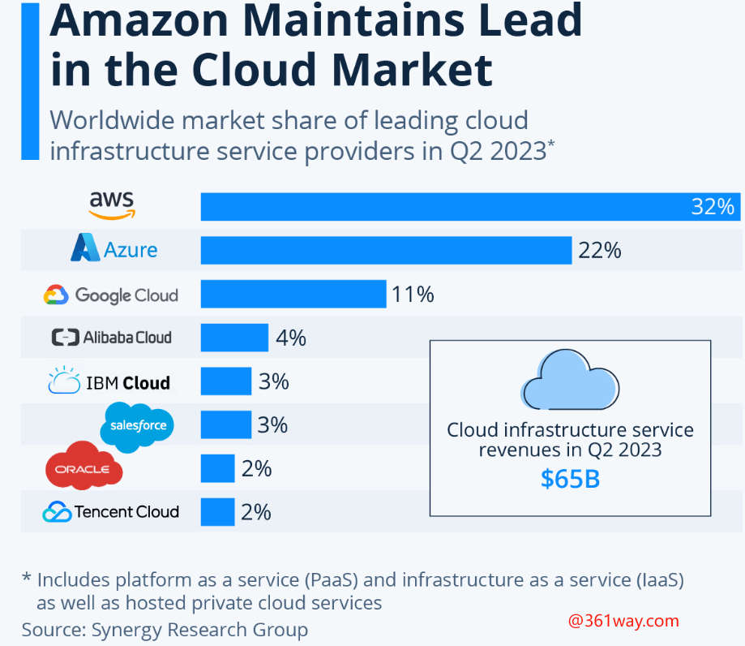

# 全球主要云厂商分析

{ width="600"}

[AWS 云服务](https://aws.amazon.com/products/)  240

[Azure 云服务](https://azure.microsoft.com/en-us/products/)  200+

[GCP 云服务](https://cloud.google.com/products)   100+

[alibabacloud](https://www.alibabacloud.com/product) 100+

[OCI](https://www.oracle.com/cloud/)

[IBM Cloud](https://www.ibm.com/cloud) 混合云

[tencent cloud](https://cloud.tencent.com/product)

[Huaweicloud](https://www.huaweicloud.com/product/) 

[statista网站的数据](https://www.statista.com/chart/18819/worldwide-market-share-of-leading-cloud-infrastructure-service-providers/)

[The top 10 public cloud providers in 2023](https://www.revolgy.com/insights/blog/the-top-10-public-cloud-providers-2023)

根据调查，2023年全球前十大云服务提供商分别是亚马逊网络服务（AWS）、微软Azure、谷歌云平台（GCP）、阿里云、甲骨文云、IBM云（Kyndryl）、腾讯云、OVHcloud、DigitalOcean和Linode（由Akamai拥有）。此次调查主要关注公有云服务提供商，而不是私有云技术（例如VMware）。

2023年全球Top 10云服务提供商排名如下表，其中包括各厂商拥有的地域数量和可用区数量：

|     | 云服务提供商         | 地区 | 可用机房 |
| :-- | :------------------- | :---: | :-------: |
| 1   | 亚马逊网络服务 (AWS) | 26   | 84       |
| 2   | 微软Azure            | 60   | 116      |
| 3   | 谷歌云平台 (GCP)     | 34   | 103      |
| 4   | 阿里云               | 27   | 84       |
| 5   | 甲骨文云             | 38   | 46       |
| 6   | IBM云（Kyndryl）     | 11   | 29       |
| 7   | 腾讯云               | 21   | 65       |
| 8   | OVH云                | 13   | 33       |
| 9   | DigitalOcean         | 8    | 14       |
| 10  | Linode               | 11   | 11       |

下面更详细地介绍概述这前10大云服务提供商。

#### 1、亚马逊网络服务（AWS）

Amazon Web Services (AWS) 是Amazon.com的云计算服务，是全球最大的云服务提供商。该企业通过其数据中心提供200多种功能齐全的服务，包括计算、存储和数据库。AWS目前有26个区域和84个可用区机房在运行。这些区域和可用性区域遍布美国、AWS GovCloud（美国）、美洲、欧洲、亚太地区以及中东和非洲。

亚马逊网络服务 (AWS) 的净销售额从2015年的约80亿美元增长到2017年的超过170亿美元，到2019年达到350亿美元，现在每年产生近740亿美元。这种惊人的增长是由于AWS从2015年的32个可用区扩展到 2017年的52个可用区，目前已达到84个可用区。与此同时，该公司推出了数千种新的AWS服务，这也间接推动了其扩张。

#### 2、微软Azure

微软公司的智能云部门包括全球第二大云服务提供商Azure。通过Microsoft Azure，该公司提供一致的混合云体验、开发人员生产力、人工智能 (AI) 功能以及安全性和合规性。Microsoft Azure目前有60个区域和116个可用性区域机房在运行。这些区域和可用性区域分布在美国、Azure Government（美国）、美洲、欧洲、亚太地区以及中东和非洲。

全球有200多个物理Microsoft Azure数据中心，其中装有计算机服务器，每个服务器都配备了独立的电源、冷却和网络。微软公司将该数据中心基础设施与140个国家/地区超过175,000英里的光纤线路连接起来。

微软云收入，包括来自Azure和其它云服务、Office 365 Commercial、LinkedIn的商业部分和Dynamics 365的收入，最近一个季度达到234亿美元，同比增长32%。因此，按年化计算，微软云收入目前为 936亿美元。不过，微软并未明确披露Azure收入，这意味着Azure只是微软云总收入的一部分。

#### 3、谷歌云平台（GCP）

谷歌云平台 (GCP) 是Alphabet Inc 的一部分，是全球第三大云服务提供商，提供企业级云服务。GCP使开发人员能够在其分布式和可扩展的基础架构上构建、测试和部署应用程序，同时利用该服务在安全、数据管理、分析和人工智能 (AI) 方面的功能。

谷歌云目前有34个区域和103个可用区机房在运行。这些区域和可用性区域遍布美国、美洲、欧洲和亚太地区。

Alphabet Inc的谷歌云部门从其基础设施、平台和其他服务收取的费用中赚取收入。在最近一个季度，谷歌云创造了58亿美元的收入，同比增长近44%。因此，按年计算，谷歌云产生了233亿美元的收入。

#### 4、阿里云

阿里巴巴集团的云计算部门，即阿里云，是全球第四大云服务提供商、亚太地区主要云供应商和中国最大的云服务提供商。通过阿里云，该业务提供云服务，包括弹性计算、数据库、存储、网络虚拟化、大规模计算、安全、管理和应用服务、大数据分析和机器学习。

阿里云目前有27个区域和84个可用区在运行。在中国大陆，阿里巴巴是占主导地位的云服务提供商，在全国拥有10多个地区。在中国大陆之外，阿里云在美国、欧洲、亚太地区和中东开展业务。

阿里巴巴集团主要根据企业客户服务的持续时间和使用情况从企业客户那里获得云计算收入。该公司的云业务在最近一个季度实现了29.9亿美元（189.71亿元人民币）的收入，同比增长12%。因此，按年化计算，阿里云收入目前接近120亿美元。

#### 5、甲骨文云

Oracle Corporation云服务产品包括Oracle云软件即服务 (SaaS) 和Oracle云基础设施（OCI）。通过OCI，该公司成为云服务提供商，提供基础设施技术即服务，包括计算、存储和网络服务。

甲骨文云目前有38个区域和46个可用性区域机房在运行。这些区域和可用性区域遍布美国、加拿大、欧洲、中东和非洲 (EMEA)、拉丁美洲和亚太地区。此外，Oracle云还为美国政府、美国国防部 (DoD) 和英国政府提供政府云区域服务。

Oracle Cloud Infrastructure（OCI）通常收取预付费用，随着客户在定义的时间段内使用其OCI服务，该费用会逐渐减少。在最近一个季度，包括IaaS和SaaS在内的Oracle云收入达到29亿美元，同比增长 19%。因此，按年计算，甲骨文云产生了116亿美元的收入。

#### 6、IBM云（Kyndryl）

2021年底，IBM将其托管基础设施服务业务分离给Kyndryl，后者现在为其提供客户设计、构建和管理私有、公有和多云环境等服务。IBM Cloud (Kyndryl) 目前有11个区域和29个可用性区域在运行。这些区域和可用性区域分布在美国、美洲、欧洲和亚太地区。

Kyndryl云服务部门通过整合独立软件供应商、公共云服务提供商、内部平台和物联网（IoT）等技术提供的服务，帮助企业优化对云服务提供商的使用。为此，Kyndryl最近与Microsoft Azure和Google Cloud 建立了新的战略关系。

#### 7、腾讯云

腾讯控股的云计算部门，被称为腾讯云，是中国第二大云服务提供商，仅次于阿里云。目前，腾讯云有21个地域和65个可用区在运行。此外，加上腾讯云的5个合作区域，公司共提供26个区域和70个可用区。

除合作伙伴地区外，腾讯云在中国大陆、美国、巴西、德国和亚太地区也开展了业务。

#### 8、OVHcloud

OVHcloud是一家专注于欧洲的云服务提供商，提供的解决方案包括裸机和托管私有云、公共云和网络云服务。

目前，OVHcloud在13个地点运营，包括33个数据中心和400,000台物理服务器。值得注意的是，OVHcloud拥有其运营的33个数据中心中的30个。这些数据中心分布在8个国家，即法国、加拿大、美国、澳大利亚、德国、波兰、英国和新加坡。

OVHcloud为超过160万客户提供域名、网络托管计划和云解决方案。在这一总数中，该公司的客户中约有800家是企业。在价值主张方面，OVHcloud运营的是低成本模式，并且通常在价格上进行竞争。

#### 9、DigitalOcean

DigitalOcean是一家云服务提供商，为开发人员、初创企业和中小型企业 (SMB) 等小型客户提供按需基础设施和平台工具。

如今，DigitalOcean在其14个数据中心运营着8个区域。具体来说，包括纽约市和旧金山metro markets以及加拿大多伦多租赁数据中心；英国伦敦；荷兰阿姆斯特丹；德国法兰克福；印度班加罗尔；和新加坡。

DigitalOcean面向超过185个国家/地区的620,000名客户提供其基础架构和软件解决方案。与其他云服务器商家不同的是，DigitalOcean约70%的收入来自美国以外的地区。与OVHcloud类似，DigitalOcean 在价格上展开竞争，通常比最大的云服务提供商的成本效益高出50%以上。

#### 10、Linode（Akamai）

2022年3 月，内容分发网络（CDN）和安全解决方案提供商Akamai Technologies以9亿美元收购了Linode。

Linode目前有11个数据中心区域在运行，通过这些区域以容器和虚拟机的形式提供计算，以及存储服务。公司的数据中心位于新泽西州纽瓦克市场；美国佐治亚州亚特兰大; 得克萨斯州达拉斯；加利福尼亚州弗里蒙特；加拿大多伦多；英国伦敦；德国法兰克福；日本东京; 新加坡; 印度孟买；和澳大利亚悉尼。

Linode的基础架构即服务（IaaS）平台以其云计算功能为全球100万客户和企业提供服务。该公司以价格竞争，专注于为开发人员以及初创企业和企业提供服务。

### 哪个云服务提供商拥有最大的市场份额？

亚马逊网络服务（AWS）、微软Azure和谷歌云平台（GCP）是市场份额最大的云服务提供商，合计占据了云基础设施服务支出的65%以上。以下是按市场份额排名前10位的云服务提供商的汇总表，突出显示了AWS的34%市场份额、Microsoft Azure的22%市场份额和Google Cloud的9.5%市场份额。

|     | 云服务提供商        | 市场份额 |
| :-- | :------------------ | :-------: |
| 1   | 亚马逊网络服务AWS） | 34%      |
| 2   | 微软Azure           | 22%      |
| 3   | 谷歌云平台（GCP）   | 9.5%     |
| 4   | 阿里云              | 6%       |
| 5   | 甲骨文云            | 2%       |
| 6   | IBM云（Kyndryl）    | 2%       |
| 7   | 腾讯云              | 2%       |
| 8   | OVH云               | <1%      |
| 9   | DigitalOcean        | <1%      |
| 10  | Linode云            | <1%      |

在过去5年中，AWS的市场份额一直保持在30%以下，Microsoft Azure的市场份额从历史上的10%左右不断上升，而微软Azure的市场份额一直在稳步增长5%的基数。在市场份额获得者的同时，这段时间也有相应的市场份额输家，其中包括IBM Cloud（Kyndryl）和一些小型云服务提供商。

### 谁是小型云服务提供商？

虽然前十大云服务提供商占据了约77%的云基础设施服务支出，但全球市场上仍然存在大量小型供应商。例如，这些云服务提供商包括那些针对特定利基市场的提供商，例如中小型企业（SMB）或在欧洲或亚太地区等区域运营的提供商。以下是这些小型云服务提供商的示例：

-   **中国：**百度AI云、华为云、金山云、京东云、青云、UCloud
-   **欧洲：** Bleu（Orange和Capgemini）、Hetzner、Leaseweb
-   **日韩：** Fujitsu、NTT、SoftBank、NAVER Cloud、KT Cloud
-   **私有云/托管服务：** Hewlett Packard Enterprise、Rackspace、VMware
-   **SaaS合作伙伴：** Salesforce、SAP
-   **中小企业：** Heroku、UpCloud、Vultr

在云服务提供商市场中，托管服务提供商（如Rackspace）有一个重要的区别。托管服务提供商帮助企业将工作负载迁移、构建和部署到公共云。随后，这些托管服务提供商跨多个环境（包括公共云、私有云和内部部署）为其客户“管理”IT 基础设施。通过这种商业模式，云服务提供商仍然是 IT 基础设施的最终所有者和提供者。

### 什么是云服务提供商？

云服务提供商为开发人员、初创企业、中小型企业和大型企业提供按需基础架构和工具，以构建、部署和扩展其软件应用程序和数据库。云服务提供商运营的两个主要市场被称为基础设施即服务 (IaaS) 和平台即服务 (PaaS)，它们包括以下内容：

-   **基础架构即服务（IaaS）：**计算、存储和网络。
-   **平台即服务 (PaaS)：**数据库管理系统和应用程序平台。

借助这种组合的IaaS和PaaS基础架构，云服务提供商支持广泛的用例，包括Web和移动应用程序、网站托管、电子商务、媒体和游戏、托管服务等等。这些计算和存储服务依赖于提供高度可扩展性和连续性的共享服务器。通常情况下，客户以按使用付费的方式使用云计算服务。

此外，某些公共云服务提供商提供软件即服务 (SaaS)，它指的是最终用户应用程序。

#### 数字基础设施

云服务提供商围绕所谓的区域和可用性区域（机房）构建他们的数字基础设施。区域是世界上云服务提供商拥有多个可用性区域的物理位置。这些可用性区域由一个或多个隔离的数据中心组成，这些数据中心位于不同的建筑物中，每个数据中心都具有冗余电源、冷却、网络和光纤连接。

可用性区域使最终用户能够运行比单个数据中心具有更高可用性、容错性和可扩展性的生产应用程序和数据库。

#### 虚拟化

云服务提供商通过虚拟化将自己与单个服务器和数据中心的功能区分开来，这意味着在硬件和应用程序之间添加一个抽象层。反过来，虚拟化使多个工作负载和操作系统能够在同一台物理服务器上运行。因此，虚拟化促进了云的关键竞争优势，包括可扩展性、最大化资源利用率以及以更低的运营费用配置更多的工作负载。

### 云计算的5大优势是什么？

云计算的5大优势是可扩展性、按使用付费、快速部署、一站式和全球访问：

1.  **可扩展性：**企业的内部IT系统可能无法扩展以满足工作负载的高峰需求，除非它们保持过剩容量——但这是昂贵的。通过使用云计算，客户可以即时增加或减少他们的硬件和软件容量需求以满足业务需求
2.  **按使用付费：**客户无需在了解数据中心和服务器将如何使用之前就将资本支出投入到数据中心和服务器中，客户可以仅在使用计算资源时付费，并且只为使用多少付费。
3.  **快速部署和敏捷性：**只需单击几下，即可在云计算环境中配置新的IT资源。因此，客户可以将向开发人员提供这些资源的时间从几周缩短到几分钟。
4.  **一站式：**云计算使客户除了避免对其数据中心进行持续维护外，还可以避免对服务器进行机架、堆叠和供电。
5.  **全球网络覆盖：**只需点击几下，即可在全球多个地区部署应用程序，这样可以使应用程序具有更低的延迟并为最终用户提供更好的体验。

与此同时，大量企业正在转向混合云和多云环境，以避免供应商锁定，并保持在更安全的环境中托管敏感工作负载的灵活性。以下是混合云和多云的定义：

-   **混合云：**在不同环境（包括内部部署、私有云和公共云）的组合中部署应用程序。
-   **多云：**与多个公共云服务提供商的应用程序部署，而不是仅使用单个公共云服务提供商。

### 哪个云服务提供商最便宜？

哪个是最便宜的云提供商？和云计算服务的成本是多少？，这里简单整理了Linode最近的比较，该比较研究了CPU专用/优化2vCPU、4GB RAM、80GB SSD部署的每月成本。以下是四大公共云服务提供商（即亚马逊网络服务、微软Azure、谷歌云平台和阿里云）针对此部署的每月成本汇总：

|     | 云服务提供商          | 每月租用费用 | 高出比 |
| :-- | :-------------------- | :-----------: | :-----: |
| 1   | 阿里云                | 48.42美元    | —      |
| 2   | 谷歌云平台 （GCP）    | 63.38美元    | 31%    |
| 3   | 微软天Azure           | 70.05美元    | 45%    |
| 4   | 亚马逊网络服务（AWS） | 71.47美元    | 48%    |

如上例所示，对于CPU Dedicated/Optimized 2vCPU、4GB RAM、80GB SSD部署，阿里云是最便宜的公共云服务提供商，每月48.42美元。相比之下，亚马逊网络服务 (AWS) 是最昂贵的公共云服务提供商，每月成本为71.47美元，比阿里云高出48%。

虽然上面的分析突出了大型供应商中最便宜的公共云服务提供商，但实际上，OVHcloud、DigitalOcean和Linode等较小的云服务提供商是最具成本效益的。与AWS、微软Azure、谷歌云和阿里云相比，这些公司的价格通常至少便宜20%到35%，而且通常大多数是便宜50%以上。