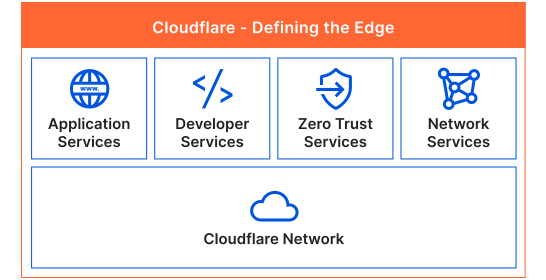

# 云厂商 cloudflare：cloud for the “everywhere world”

## cloudflare公司简介

{ width="400" align=right}

[Cloudflare](https://www.cloudflare.com/) 是一家内容分发网络 (CDN) 和网络安全公司，Cloudflare 由 Matthew Prince 和 Lee Holloway 于 2009 年创立。该公司在全球拥有超过 200 个数据中心，为超过 20 亿人提供服务。总部位于美国加利福尼亚州旧金山。Cloudflare 提供内容交付网络 (CDN)、网络安全、域名注册、DNS 服务、全站 SSL/TLS 加密等服务，帮助网站和应用程序提高性能、安全性和可靠性。

比如知名的 `1.1.1.1` DNS服务就是该公司提供的，对标Google的 `8.8.8.8` ，都比较好记。像 Cloudflare’s SSE & SASE Platform 零信任网络也是业界的佼佼者。

[What is Cloudflare?](https://www.cloudflare.com/what-is-cloudflare/)

## Cloudflare 的主要服务

<figure markdown>
  
  <figcaption>slogan: Helping build a better Internet</figcaption>
</figure>

- **CDN：** Cloudflare 的 CDN 有遍布全球的服务器，可以帮助提高网站的速度和可靠性，通过从距离用户最近的服务器提供内容。
- **安全：** Cloudflare 提供各种安全服务，例如 DDoS 保护、Web 应用程序防火墙 (WAF) 和 DNSSEC，可以帮助保护网站免受攻击。
- **分析：** Cloudflare 提供网站分析服务，可以帮助网站所有者了解网站的流量和性能。
- **开发：** Cloudflare 提供开发工具和 API，可以帮助开发人员构建和部署网站。

Cloudflare 的服务由免费和付费计划提供。免费计划提供基本的 CDN 和安全功能，而付费计划提供更多功能和支持。Cloudflare 的客户包括全球数百万网站，其中包括一些最大的和最受欢迎的网站，如 Google、Facebook 和 Wikipedia。

[cloudflare Products](https://www.cloudflare.com/zero-trust/products/)

### CDN

Cloudflare 的 CDN 有遍布全球的 200 多个数据中心，可以帮助提高网站的速度和可靠性。当用户访问网站时，Cloudflare 会将请求路由到距离用户最近的服务器。这可以减少延迟并提高网站的响应速度。

Cloudflare 的 CDN 还可以帮助提高网站的可靠性。如果网站的主机服务器发生故障，Cloudflare 可以将流量路由到备用服务器。这可以确保网站始终可用。

### 安全

Cloudflare 提供各种安全服务来保护网站免受攻击。这些服务包括：

- **DDoS 保护：** Cloudflare 可以帮助保护网站免受分布式拒绝服务 (DDoS) 攻击。DDoS 攻击是指大量来自不同来源的恶意流量，旨在使网站瘫痪。
- **Web 应用程序防火墙 (WAF)：** Cloudflare 的 WAF 可以帮助保护网站免受各种攻击，包括 SQL 注入、跨站脚本攻击 (XSS) 和拒绝服务攻击。
- **DNSSEC：** DNSSEC 可以帮助保护 DNS 查询免受攻击。DNS 是用于将域名转换为 IP 地址的系统。

### 分析

Cloudflare 提供网站分析服务，可以帮助网站所有者了解网站的流量和性能。这些服务包括：

- **Web 性能分析：** Cloudflare 可以帮助网站所有者了解网站的性能，包括页面加载时间和用户体验。
- **流量分析：** Cloudflare 可以帮助网站所有者了解网站的流量来源和趋势。
- **安全分析：** Cloudflare 可以帮助网站所有者了解网站的安全状况。

### 开发

Cloudflare 提供开发工具和 API，可以帮助开发人员构建和部署网站。这些工具和 API 包括：

- **Cloudflare Workers：** Cloudflare Workers 是一个无服务器平台，可以让开发人员在 Cloudflare 网络上运行代码。
- **Cloudflare Pages：** Cloudflare Pages 是一个托管服务，可以让开发人员快速构建和部署静态网站。
- **Cloudflare API：** Cloudflare API 可以让开发人员与 Cloudflare 服务进行交互。

Cloudflare 是一家领先的 CDN 和网络安全公司，提供各种服务来帮助提高网站的性能和安全性。如果您正在寻找一种方法来提高网站的性能和安全性，Cloudflare 是一个不错的选择。

## 竞争与优势

### Cloudflare 的主要竞争对手

- **Zscaler：** Zscaler 是一家领先的零信任网络公司，提供基于云的零信任网络解决方案。
- **Fastly：** Fastly 是一家内容分发网络 (CDN) 公司，提供 CDN 和安全服务。
- **Akamai：** Akamai 是一家领先的 CDN 公司，提供 CDN 和安全服务。
- **Imperva：** Imperva 是一家网络安全公司，提供 DDoS 保护、Web 应用程序防火墙 (WAF) 和应用程序安全测试 (AST) 等服务。
- **F5 Networks：** F5 Networks 是一家网络安全公司，提供 DDoS 保护、Web 应用程序防火墙 (WAF) 和应用程序交付控制器 (ADC) 等服务。
- **Palo Alto Networks:** Palo Alto Networks 是一家总部位于美国加利福尼亚州圣何塞的网络安全公司。Palo Alto Networks 提供各种网络安全产品和解决方案，包括防火墙、入侵检测系统 (IDS) 和入侵预防系统 (IPS)。

### Cloudflare 的主要竞争优势

1. **全球覆盖范围：** Cloudflare 拥有遍布全球的 200 多个数据中心，可以为全球用户提供服务。
1. **免费计划：** Cloudflare 提供免费计划，可以满足中小企业的需求。
1. **易用性：** Cloudflare 的服务易于设置和使用，即使是没有技术经验的用户也可以使用。