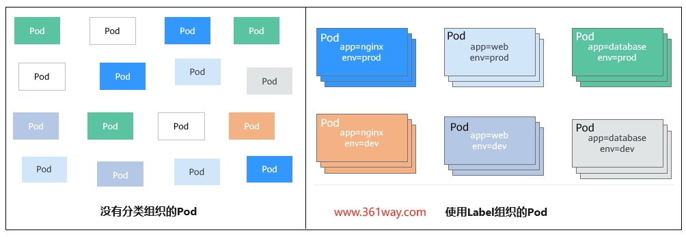

# 通过Label标签管理k8s资源

## 为什么需要Label

当资源变得非常多的时候，如何分类管理就非常重要了，Kubernetes提供了一种机制来为资源分类，那就是Label（标签）。Label非常简单，但是却很强大，Kubernetes中几乎所有资源都可以用Label来组织。Label的具体形式是key-value的标记对，可以在创建资源的时候设置，也可以在后期添加和修改。

以Pod为例，当Pod变得多起来后，就显得杂乱且难以管理，如下图所示。



!!! note

    - 这个是不是有点像快递和仓储中心。当东西少的时候都好说，你可以把所有东西都往一个屋子里放；
    - 当货物或快件变的多的时候，需要给不同的货物打上不同的标签，分门别类，这样所有人都可以根据货架号和货架各层的标号取到相就好的东西。

## label 的增加和删除

分别创建一个pod/deployment，查看其对应的labels值，并通过label值过滤对应的pod

```bash
[root@testcce-26771 ~]# kubectl run nginx --image=nginx:alpine
pod/nginx created
[root@testcce-26771 ~]# kubectl create deployment web --image=nginx:alpine
deployment.apps/web created
[root@testcce-26771 ~]# kubectl get pods --show-labels
NAME                   READY   STATUS    RESTARTS   AGE   LABELS
nginx                  1/1     Running   0          16s   node-local-dns-injection=injected,run=nginx
web-5bf684665b-dzz9l   1/1     Running   0          8s    app=web,node-local-dns-injection=injected,pod-template-hash=5bf684665b
[root@testcce-26771 ~]# kubectl get pods -l app
NAME                   READY   STATUS    RESTARTS   AGE
web-5bf684665b-dzz9l   1/1     Running   0          47s
```

### 添加Label

Label的形式为key-value形式，使用非常简单，如下，为Pod设置了app=nginx和env=prod两个Label。

```yaml
apiVersion: v1
kind: Pod
metadata:
  name: nginx
  labels:                     # 为Pod设置两个Label    
    app: nginx    
    env: prod
spec:
  containers:
  - image: nginx:alpine
    name: container-0
    resources:
      limits:
        cpu: 100ms
        memory: 200Mi
      requests:
        cpu: 100m
        memory: 200Mi
  imagePullSecrets:
  - name: default-secret
```

Pod有了Label后，在查询Pod的时候带上--show-labels就可以看到Pod的Label。

```bash
$ kubectl get pod --show-labels
NAME              READY   STATUS    RESTARTS   AGE   LABELS
nginx             1/1     Running   0          50s   app=nginx,env=prod
```

还可以使用-L只查询某些固定的Label。

```bash
$ kubectl get pod -L app,env 
NAME              READY   STATUS    RESTARTS   AGE   APP     ENV
nginx             1/1     Running   0          1m    nginx   prod
```

对已存在的Pod，可以直接使用kubectl label命令直接添加Label。

```bash
$ kubectl label pod nginx creation_method=manual
pod/nginx labeled

$ kubectl get pod --show-labels
NAME              READY   STATUS    RESTARTS   AGE   LABELS
nginx             1/1     Running   0          50s   app=nginx, creation_method=manual,env=prod


# 列出所有不包含 env 标签的pod,无论其值如何：
$ kubectl get pod -L '!env'

# 列出所有不包含 env!=prod 标签键值的pod：
$ kubectl get pod -l 'env!=prod'
```

### 修改Label

对于已存在的Label，如果要修改的话，需要在命令中带上--overwrite，如下所示。

```bash
$ kubectl label pod nginx env=debug --overwrite
pod/nginx labeled

$ kubectl get pod --show-labels
NAME              READY   STATUS    RESTARTS   AGE   LABELS
nginx             1/1     Running   0          50s   app=nginx,creation_method=manual,env=debug
```

### 删除Label

对于已存在的Label，如果要删除的话，只需要在对应的lable key值后面加上减号就可以了

```bash
$ kubectl label pod nginx env-
pod/nginx labeled

$ kubectl get pod --show-labels
NAME              READY   STATUS    RESTARTS   AGE   LABELS
nginx             1/1     Running   0          50s   app=nginx,creation_method=manual
```

!!! note

    Lables是可以在namespace、pod、deployments、statefulsets、service、secrets等几乎所有k8s资源中使用的。

## 通过标签管理调度

设置标签的一个是作用是方便管理查询，另一个作用是可以更好的进行管理调度。

```bash hl_lines="20 21 26"
# 给 node 节点设置label标签
[root@testcce-26771 ~]# kubectl get nodes
NAME           STATUS   ROLES    AGE   VERSION
192.168.0.26   Ready    <none>   4h    v1.25.3-r0-25.1.23
192.168.0.35   Ready    <none>   19h   v1.25.3-r0-25.1.23
[root@testcce-26771 ~]# kubectl label nodes 192.168.0.26 disk-
node/192.168.0.26 unlabeled
[root@testcce-26771 ~]# kubectl get nodes -l disk
No resources found
[root@testcce-26771 ~]# kubectl label nodes 192.168.0.26 disk=ssd
node/192.168.0.26 labeled
[root@testcce-26771 ~]# kubectl get nodes -l disk
NAME           STATUS   ROLES    AGE    VERSION
192.168.0.26   Ready    <none>   4h1m   v1.25.3-r0-25.1.23

# 通过给deployement更新nodeSelector选择标签选择对应的node节点
[root@testcce-26771 ~]# kubectl get pods  -o wide
NAME                   READY   STATUS    RESTARTS   AGE   IP            NODE           NOMINATED NODE   READINESS GATES
nginx                  1/1     Running   0          18m   172.16.0.9    192.168.0.35   <none>           <none>
web-7564c4fd95-grvxp   1/1     Running   0          6s    172.16.0.14   192.168.0.35   <none>           <none>
[root@testcce-26771 ~]# kubectl patch deployments web --type merge -p '{"spec":{"template":{"spec":{"nodeSelector":{"disk":"ssd"}}}}}'
deployment.apps/web patched
[root@testcce-26771 ~]# kubectl get pods  -o wide
NAME                   READY   STATUS    RESTARTS   AGE   IP             NODE           NOMINATED NODE   READINESS GATES
nginx                  1/1     Running   0          19m   172.16.0.9     192.168.0.35   <none>           <none>
web-7fcb4cc99c-6fgfb   1/1     Running   0          5s    172.16.0.136   192.168.0.26   <none>           <none>
```

!!! note

    注意看高亮的三行的变化，这里通过更新选择相应的node标签，强制deployments运行的 pod 在特定的节点上运行。


上面kubectl patch命令执行的内容和更新以下yaml文件的效果相同：

```yaml hl_lines="26 27"
apiVersion: apps/v1
kind: Deployment
metadata:
  name:  web
  namespace: default
  labels:
    app:  web
spec:
  selector:
    matchLabels:
      app: web
  replicas: 1
  template:
    metadata:
      labels:
        app:  web
    spec:
      containers:
      - name:  web
        image:  "swr.la-north-2.myhuaweicloud.com/hcie/nginx:v1"
        ports:
        - containerPort:  80
          name:  web
      imagePullSecrets:
      - name: default-secret
      nodeSelector:
        disk: ssd
```